# 第7章 Nmstate简介

nmstate 是一个声明式的网络管理工具。 nmstate 软件提供 libnmstate Python库，以及用于管理NetworkManager的命令行工具 nmstatectl 。使用 Nmstate 时，您可以使用 YAML 或 JSON 格式的说明描述预期的网络状态。

使用Nmstate的优点：
- 提供稳定且可扩展的接口来管理 OpenCLoudOS 网络功能
- 支持主机和集群级别的原子和事务操作
- 支持对大多数属性进行部分编辑，并保留未在说明中指定的现有设置
- 提供插件支持，使管理员能够使用自己的插件

## 7.1.在Python程序中使用libnmstate库

libnmstate Python 库可让开发人员在他们自己的应用程序中使用 Nmstate

要使用库，请在源代码中导入它：
 ```python
import libnmstate
```

请注意，您必须先安装 nmstate 软件包才能使用这个库。

案例：使用 libnmstate 库查询网络状态

下面的代码导入了 libnmstate 库，并显示可用的网络接口及其状态：

```python
import json
import libnmstate
from libnmstate.schema import Interface

net_state = libnmstate.show()
for iface_state in net_state[Interface.KEY]:
    print(iface_state[Interface.NAME] + ": "
        + iface_state[Interface.STATE])
```

## 7.2.使用nmstatectl更新网络配置

您可以使用 nmstatectl 工具将一个或多个接口的当前网络配置存储在一个文件中。然后您可以使用此文件：

- 修改配置并将其应用到同一系统。
- 将文件复制到其他主机上，并使用相同的或经过修改的设置配置主机。

下面介绍了如何将 ens3 接口的设置导出到文件中，修改配置，并在主机上应用设置。

**前提条件**

- nmstate 软件包已安装。

**流程**

1. 将 ens3 接口的设置导出到 ~/network-config.yml 文件：
    ```
    # nmstatectl show ens3 > ~/network-config.yml
    ```
    此命令会以 YAML 格式存储 ens3 的配置。要以 JSON 格式存储输出，请将 --json 选项传给命令。

    如果没有指定接口名称，nmstatectl 将导出所有接口的配置。
2. 使用文本编辑器修改 ~/network-config.yml 文件，以更新配置。
3. 应用 ~/network-config.yml 文件中的设置：
    ```
    # nmstatectl apply ~/network-config.yml
    ```
    如果您以 JSON 格式导出设置，请将 --json 选项传给命令。

## 7.3.其他
    /usr/share/doc/nmstate/README.md
    /usr/share/doc/nmstate/examples/

# 第8章 配置以太网连接

## 8.1.使用nmcli配置静态以太网连接

**流程**

1. 添加新的NetworkManager网络连接配置集：
    ```
    # nmcli connection add con-name test-con ifname ens4 type ethernet
    ```
    修改 test-con 为您需要的网络连接配置集。
2. 设置IPv4地址：
    ```
    # nmcli connection modify test-con ipv4.addresses 192.128.1.1/24
    ```
3. 设置IPv6地址：
    ```
    #  nmcli connection modify test-con ipv6.addresses AD80::ABAA:0000:00C2:0002/64
    ```
4. 将 IPv4 和 IPv6 连接方法设置为 manual：
    ```
    #  nmcli connection modify test-con ipv6.method manual
    #  nmcli connection modify test-con ipv4.method manual
    ```
5. 设置 IPv4 和 IPv6 默认网关：
    ```
    #  nmcli connection modify test-con ipv4.gateway 192.128.1.254
    #  nmcli connection modify test-con ipv6.gateway AD80::ABAA:0000:00C2:FFFE
    ```
6. 设置 IPv4 和 IPv6 DNS 服务器地址：
    ```
    #  nmcli connection modify test-con ipv6.dns "AD80::ABAA:0000:00C2:0001"
    #  nmcli connection modify test-con ipv4.dns "114.114.114.114"
    ```
7. 为 IPv4 和 IPv6 连接设置 DNS 搜索域：
    ```
    #  nmcli connection modify test-con ipv4.dns-search test.com
    #  nmcli connection modify test-con ipv6.dns-search test.com
    ```
8. 激活连接配置集：
    ```
    # nmcli connection up test-con
    ```

**验证**

1. 显示设备和连接的状态：
    ```
    # nmcli device status
    DEVICE      TYPE      STATE      CONNECTION
    ens4      ethernet  connected  test-con
    ```
2. 显示网络连接配置集所有设置：
    ```
    # nmcli connection show test-con
    connection.id:              test-con
    connection.uuid:            b6cdfa1c-e4ad-46e5-af8b-a75f06b79f76
    connection.stable-id:       --
    connection.type:            802-3-ethernet
    connection.interface-name:  ens4
    ...
    ```
3. 使用 ping 命令验证网络连通性：
   - 同一子网：
        IPv4:
        ```
        # ping 192.128.1.3
        ```
        IPv6:
        ```
        # ping AD80::ABAA:0000:00C2:0005
        ```
        如果命令失败，请检查IP和子网设置。
        
   - 远程子网：
        IPv4:
        ```
        # ping 192.168.1.3
        ```
        IPv6:
        ```
        # ping AD80::ABAA:0000:00C3:0005
        ```
        - 如果命令失败，先 ping 默认网关验证设置。
            IPv4:
            ```
            # ping 192.128.1.254
            ```
            IPv6:
            ```
            # ping AD80::ABAA:0000:00C2:FFFE
            ```
4. 使用 host 命令验证域名解析是否正常：
    ```
    # host client.test.com
    ```
    如果命令返回任何错误，如 connection timed out 或 no servers could be reached，请验证您的 DNS 设置。

**故障排除步骤**
如果连接失败，或者网络接口在上线和关闭状态间切换：

- 确保网络电缆插入到主机和交换机。
- 检查连接失败是否只存在于这个主机上，或者其他连接到该服务器连接的同一交换机的主机中。
- 验证网络电缆和网络接口是否如预期工作。执行硬件诊断步骤并替换有缺陷的电缆和网络接口卡。
- 如果磁盘中的配置与设备中的配置不匹配，则启动或重启 NetworkManager 会创建一个代表该设备的配置的内存连接。

## 8.2.使用nmcli互动编辑器配置静态以太网连接

**流程**

1. 以互动模式添加 NetworkManager 网络连接配置集：
    ```
    # nmcli connection edit type ethernet con-name test-con
    ```
2. 设置网络接口：
    ```
    nmcli> set connection.interface-name ens4
    ```
3. 设置IPv4地址：
    ```
    nmcli> set ipv4.addresses 192.128.1.1/24
    ```
4. 设置IPv6地址：
    ```
    nmcli> set ipv6.addresses AD80::ABAA:0000:00C2:0002/64
    ```
5. 将 IPv4 和 IPv6 连接方法设置为 manual：
    ```
    nmcli> set ipv4.method manual
    nmcli> set ipv6.method manual
    ```
6. 设置 IPv4 和 IPv6 默认网关：
    ```
    nmcli> set ipv4.gateway 192.128.1.254
    nmcli> set ipv6.gateway AD80::ABAA:0000:00C2:FFFE
    ```
7. 设置 IPv4 和 IPv6 DNS 服务器地址：
    ```
    nmcli> set ipv4.dns 114.114.114.114
    nmcli> set ipv6.dns AD80::ABAA:0000:00C2:0001
    ```
    要设置多个 DNS 服务器，以空格分隔并用引号括起来。
8. 为 IPv4 和 IPv6 连接设置 DNS 搜索域：
    ```
    nmcli> set ipv4.dns-search example.com
    nmcli> set ipv6.dns-search example.com
    ```
9. 保存并激活连接：
    ```
    nmcli> save persistent
    Saving the connection with 'autoconnect=yes'. That might result in an immediate activation of the connection.
    Do you still want to save? (yes/no) [yes] yes
    ```

10. 退出互动模式：
    ```
    nmcli> quit
    ```

**验证**

1. 显示设备和连接的状态：
    ```
    # nmcli device status
    DEVICE      TYPE      STATE      CONNECTION
    ens4      ethernet  connected  test-con
    ```
2. 显示网络连接配置集所有设置：
    ```
    # nmcli connection show test-con
    connection.id:              test-con
    connection.uuid:            b6cdfa1c-e4ad-46e5-af8b-a75f06b79f76
    connection.stable-id:       --
    connection.type:            802-3-ethernet
    connection.interface-name:  ens4
    ...
    ```
3. 使用 ping 命令验证网络连通性：
   - 同一子网：
        IPv4:
        ```
        # ping 192.128.1.3
        ```
        IPv6:
        ```
        # ping AD80::ABAA:0000:00C2:0005
        ```
        如果命令失败，请检查IP和子网设置。
        
   - 远程子网：
        IPv4:
        ```
        # ping 192.168.1.3
        ```
        IPv6:
        ```
        # ping AD80::ABAA:0000:00C3:0005
        ```
        - 如果命令失败，先 ping 默认网关验证设置。
            IPv4:
            ```
            # ping 192.128.1.254
            ```
            IPv6:
            ```
            # ping AD80::ABAA:0000:00C2:FFFE
            ```
4. 使用 host 命令验证域名解析是否正常：
    ```
    # host client.test.com
    ```
    如果命令返回任何错误，如 connection timed out 或 no servers could be reached，请验证您的 DNS 设置。

**故障排除步骤**
如果连接失败，或者网络接口在上线和关闭状态间切换：

- 确保网络电缆插入到主机和交换机。
- 检查连接失败是否只存在于这个主机上，或者其他连接到该服务器连接的同一交换机的主机中。
- 验证网络电缆和网络接口是否如预期工作。执行硬件诊断步骤并替换有缺陷的电缆和网络接口卡。
- 如果磁盘中的配置与设备中的配置不匹配，则启动或重启 NetworkManager 会创建一个代表该设备的配置的内存连接。

## 8.3.使用nmstatectl配置静态以太网连接

**前提条件**

- 已安装 nmstate 。

**流程**

1. 创建一个 YAML 文件 ~/create-ethernet-profile.yml 包含以下内容：
    ```
    ---
    dns-resolver:
    config:
        search: []
        server:
        - 114.114.114.114
    route-rules:
    config: []
    routes:
    config:
    - destination: 0.0.0.0/0
        metric: 100
        next-hop-address: 192.168.128.1
        next-hop-interface: ens3
        table-id: 254
    interfaces:
    - name: ens3
    type: ethernet
    state: up
    accept-all-mac-addresses: false
    ipv4:
        enabled: true
        address:
      - ip: 192.168.133.95
        prefix-length: 20
      dhcp: false
    ipv6:
      enabled: true
      address:
      - ip: fe80::f816:3eff:fec6:ce86
        prefix-length: 64
      auto-dns: true
      auto-gateway: true
      auto-route-table-id: 0
      auto-routes: true
      autoconf: true
      dhcp: true
    ```
2. 将配置应用到系统：
    ```
    # nmstatectl apply ~/create-ethernet-profile.yml
    ```

**验证**

1. 显示设备和连接的状态：
    ```
    # nmcli device status
    DEVICE      TYPE      STATE      CONNECTION
    ens3      ethernet  connected  ens3
    ```
2. 显示连接配置集的所有设置：
    ```
    # nmcli connection show ens3
    connection.id:              ens3
    connection.uuid:            b6cdfa1c-e4ad-46e5-af8b-a75f06b79f76
    connection.stable-id:       --
    connection.type:            802-3-ethernet
    connection.interface-name:  ens3
    ...
    ```
3. 以 YAML 格式显示连接设置：
    ```
    # nmstatectl show ens3
    ```

## 8.4.使用rhel-ssystem-roles配置带有接口名称的静态以太网连接

**前提条件**

- 已安装 rhel-system-roles 和 ansible 。
- 如果您在运行 playbook 时使用了非 root 用户，则要求该用户拥有 sudo 权限。
- 主机使用 NetworkManager 配置网络。

**流程**

1. 将主机IP或名称添加到/etc/ansible/hosts Ansible 清单文件中：
    ```
    node.example.com
    ```

2. 创建playbook ~/ethernet-static-IP.yml：
    ```
    ---
    - name: Configure an Ethernet connection with static IP
      hosts: node.example.com
      become: true
      tasks:
     - include_role:
         name: rhel-system-roles.network

       vars:
         network_connections:
           - name: enp7s0
             interface_name: enp7s0
             type: ethernet
             autoconnect: yes
             ip:
               address:
                 - 192.0.2.1/24
                 - 2001:db8:1::1/64
               gateway4: 192.0.2.254
               gateway6: 2001:db8:1::fffe
               dns:
                 - 192.0.2.200
                 - 2001:db8:1::ffbb
               dns_search:
                 - example.com
             state: up
    ```

3. 运行playbook：
    - 通过 root 用户身份连接到受管主机，请输入：
        ```
        # ansible-playbook -u root ~/ethernet-static-IP.yml
        ```
    - 通过用户身份连接到受管主机，请输入：
        ```
        # ansible-playbook -u user_name --ask-become-pass ~/ethernet-static-IP.yml
        ```
        --ask-become-pass 选项确保 ansible-playbook 命令提示输入 -u user_name 选项中定义的用户的 sudo 密码。

    如果没有指定 -u user_name 选项，ansible-playbook 以当前登录到控制节点的用户身份连接到受管主机。


## 8.5.使用rhel-ssystem-roles配置带有设备路径的静态以太网连接

您可以使用以下命令识别设备路径：
```
# udevadm info /sys/class/net/<device_name> | grep ID_PATH=
```

**前提条件**

- 已安装 rhel-system-roles 和 ansible 。
- 如果您在运行 playbook 时使用了非 root 用户，则要求该用户拥有 sudo 权限。
- 主机使用 NetworkManager 配置网络。

**流程**

1. 将主机IP或名称添加到/etc/ansible/hosts Ansible 清单文件中：
    ```
    node.example.com
    ```

2. 创建playbook ~/ethernet-dynamic-IP.yml 包含以下内容：
    ```
    ---
      - name: Configure an Ethernet connection with dynamic IP
      hosts: node.example.com
      become: true
      tasks:
      - include_role:
         name: rhel-system-roles.network

       vars:
         network_connections:
           - name: example
             match:
               path:
                 - pci-0000:00:0[1-3].0
                 - &!pci-0000:00:02.0
             type: ethernet
             autoconnect: yes
             ip:
               address:
                 - 192.0.2.1/24
                 - 2001:db8:1::1/64
               gateway4: 192.0.2.254
               gateway6: 2001:db8:1::fffe
               dns:
                 - 192.0.2.200
                 - 2001:db8:1::ffbb
               dns_search:
                 - example.com
             state: up
    ```
    本例中的 match 参数定义了 Ansible 将脚本应用到与 PCI ID 0000:00:0[1-3].0 匹配的设备，但没有 0000:00:02.0 设备。有关可以使用的特殊修饰符和通配符的详情，请查看 /usr/share/ansible/roles/rhel-system-roles.network/README.md 文件中的 match 参数描述。

3. 运行playbook：
    - 通过 root 用户身份连接到受管主机，请输入：
        ```
        # ansible-playbook -u root ~/ethernet-dynamic-IP.yml
        ```
    - 通过用户身份连接到受管主机，请输入：
        ```
        # ansible-playbook -u user_name --ask-become-pass ~/ethernet-dynamic-IP.yml
        ```
        --ask-become-pass 选项确保 ansible-playbook 命令提示输入 -u user_name 选项中定义的用户的 sudo 密码。

    如果没有指定 -u user_name 选项，ansible-playbook 以当前登录到控制节点的用户身份连接到受管主机。

## 8.6.使用nmcli配置动态以太网连接

**前提条件**

- 网络中有DHCP服务器

**流程**

1. 为以太网连接添加新的 NetworkManager 连接配置集：
    ```
    # nmcli connection add con-name Example-Connection ifname enp7s0 type ethernet
    ```

2. (可选)在使用 Example-Connection 配置文件时，更改 NetworkManager 发送给 DHCP 服务器的主机名：
    ```
    # nmcli connection modify Example-Connection ipv4.dhcp-hostname Example ipv6.dhcp-hostname Example
    ```

3. (可选)在使用 Example-Connection 配置文件时，更改 NetworkManager 发送给 IPv4 DHCP 服务器的客户端 ID：
    ```
    # nmcli connection modify Example-Connection ipv4.dhcp-client-id client-ID
    ```
    请注意，对于 IPv6 ，没有 dhcp-client-id 参数。要为 IPv6 创建一个标识符，请配置 dhclient 服务。

**验证**

1. 显示设备和连接的状态：
    ```
    # nmcli device status
    DEVICE      TYPE      STATE      CONNECTION
    enp7s0      ethernet  connected  Example-Connection
    ```

2. 显示连接配置集的所有设置：
    ```
    # nmcli connection show Example-Connection
    connection.id:              Example-Connection
    connection.uuid:            b6cdfa1c-e4ad-46e5-af8b-a75f06b79f76
    connection.stable-id:       --
    connection.type:            802-3-ethernet
    connection.interface-name:  enp7s0
    ...
    ```

3. 使用 ping 程序来验证网络连通性。
    - 查找同一子网中的 IP 地址。
        IPv4:
            ```
            # ping 192.0.2.3
            ```
            IPv6:
            ```
            # ping 2001:db8:1::2
            ```
    - 在远程子网中查找 IP 地址。
        IPv4:
        ```
        # ping 192.0.2.3
        ```
        IPv6:
        ```
        # ping 2001:db8:2::1
        ```
        - 如果命令失败，则使用 ping 默认网关来验证设置。
            IPv4:
            ```
            # ping 192.0.2.254
            ```
            IPv6:
            ```
            # ping 2001:db8:1::fff3
            ```

4. 使用 host 命令验证域名解析是否正常：
    ```
    # host client.test.com
    ```
    如果命令错误，如 connection timed out 或 no servers could be reached，请验证您的 DNS 设置。

## 8.7.使用 nmcli 互动编辑器配置动态以太网连接

**前提条件**

- 网络中有 DHCP 服务器。

**流程**

1. 为以太网连接添加新的 NetworkManager 连接配置集并启动互动模式：
    ```
    # nmcli connection edit type ethernet con-name Example-Connection
    ```

2. 设置网络接口：
    ```
    nmcli> set connection.interface-name enp7s0
    ```

3. （可选）在使用 Example-Connection 配置文件时，更改 NetworkManager 发送给 DHCP 服务器的主机名：
    ```
    nmcli> set ipv4.dhcp-hostname Example
    nmcli> set ipv6.dhcp-hostname Example
    ```

4. （可选）在使用 Example-Connection 配置文件时，更改 NetworkManager 发送给 IPv4 DHCP 服务器的客户端 ID：
    ```
    nmcli> set ipv4.dhcp-client-id client-ID
    ```
    请注意，对于 IPv6 ，没有 dhcp-client-id 参数。要为 IPv6 创建一个标识符，请配置 dhclient 服务。

5. 保存并激活连接：
    ```
    nmcli> save persistent
    Saving the connection with 'autoconnect=yes'. That might result in an immediate activation of the connection.
    Do you still want to save? (yes/no) [yes] yes
    ```

6. 保存并退出互动模式：
    ```
    nmcli> quit
    ```

**验证**

1. 显示设备和连接的状态：
    ```
    # nmcli device status
    DEVICE      TYPE      STATE      CONNECTION
    enp7s0      ethernet  connected  Example-Connection
    ```

2. 显示连接配置集的所有设置：
    ```
    # nmcli connection show Example-Connection
    connection.id:              Example-Connection
    connection.uuid:            b6cdfa1c-e4ad-46e5-af8b-a75f06b79f76
    connection.stable-id:       --
    connection.type:            802-3-ethernet
    connection.interface-name:  enp7s0
    ...
    ```

3. 使用 ping 程序来验证网络连通性。
    - 查找同一子网中的 IP 地址。
        IPv4:
            ```
            # ping 192.0.2.3
            ```
            IPv6:
            ```
            # ping 2001:db8:1::2
            ```
    - 在远程子网中查找 IP 地址。
        IPv4:
        ```
        # ping 192.0.2.3
        ```
        IPv6:
        ```
        # ping 2001:db8:2::1
        ```
        - 如果命令失败，则使用 ping 默认网关来验证设置。
            IPv4:
            ```
            # ping 192.0.2.254
            ```
            IPv6:
            ```
            # ping 2001:db8:1::fff3
            ```

4. 使用 host 命令验证域名解析是否正常：
    ```
    # host client.test.com
    ```
    如果命令错误，如 connection timed out 或 no servers could be reached，请验证您的 DNS 设置。

## 8.8使用 nmstatectl 配置动态以太网连接

本节介绍了如何使用 nmstatectl 工具为 enp7s0 设备添加动态以太网连接。在这个过程中的设置中，NetworkManager 从 DHCP 服务器请求此连接的 IP 设置。

nmstatectl 工具确保设置配置后，结果与配置文件匹配。如果有任何失败，nmstatectl 会自动回滚更改以避免系统处于不正确的状态。

该流程以 YAML 格式定义接口配置。或者，您也可以以 JSON 格式指定配置：

**前提条件**

- 已安装 nmstate 软件。

**流程**

1. 创建一个 YAML 文件 ~/create-ethernet-profile.yml ，包含以下内容：
    ```
    ---
    interfaces:
    - name: enp7s0
    type: ethernet
    state: up
    ipv4:
        enabled: true
        auto-dns: true
        auto-gateway: true
        auto-routes: true
        dhcp: true
    ipv6:
        enabled: true
        auto-dns: true
        auto-gateway: true
        auto-routes: true
        autoconf: true
        dhcp: true
    ```

2. 将配置应用到系统：
    ```
    # nmstatectl apply ~/create-ethernet-profile.yml
    ```

**验证**

1. 显示设备和连接的状态：
    ```
    # nmcli device status
    DEVICE      TYPE      STATE      CONNECTION
    enp7s0      ethernet  connected  enp7s0
    ```

2. 显示连接配置集的所有设置：
    ```
    # nmcli connection show enp7s0
    connection.id:              enp7s0
    connection.uuid:            b6cdfa1c-e4ad-46e5-af8b-a75f06b79f76
    connection.stable-id:       --
    connection.type:            802-3-ethernet
    connection.interface-name:  enp7s0
    ...
    ```

3. 以 YAML 格式显示连接设置：
    ```
    # nmstatectl show enp7s0
    ```

## 8.9.使用带有接口名称的 rhel-system-roles 配置动态以太网连接

**前提条件**

- 网络中有 DHCP 服务器。
- ansible 和 rhel-system-roles 软件包已安装在控制节点上。
- 如果您在运行 playbook 时使用了非 root 用户，则要求该用户拥有 sudo 权限。
- 主机使用 NetworkManager 配置网络。

**流程**

1. 如果您要在其上执行 playbook 中指令的主机还没有被列入清单，请将此主机的 IP 或名称添加到 /etc/ansible/hosts Ansible 清单文件中：
    ```
    node.example.com
    ```

2. 使用以下内容创建playbook ~/ethernet-dynamic-IP.yml：
    ```
    ---
    - name: Configure an Ethernet connection with dynamic IP
        hosts: node.example.com
        become: true
        tasks:
        - include_role:
            name: rhel-system-roles.network

        vars:
            network_connections:
            - name: enp7s0
                interface_name: enp7s0
                type: ethernet
                autoconnect: yes
                ip:
                dhcp4: yes
                auto6: yes
                state: up
    ```

3. 运行playbook：
    - 通过 root 用户身份连接到受管主机，请输入：
        ```
        # ansible-playbook -u root ~/ethernet-dynamic-IP.yml
        ```
    - 通过用户身份连接到受管主机，请输入：
        ```
        # ansible-playbook -u user_name --ask-become-pass ~/ethernet-dynamic-IP.yml
        ```
        --ask-become-pass 选项确保 ansible-playbook 命令提示输入 -u user_name 选项中定义的用户的 sudo 密码。

    如果没有指定 -u user_name 选项，ansible-playbook 以当前登录到控制节点的用户身份连接到受管主机。

## 8.10.使用 rhel-system-roles 配置带有设备路径的动态以太网连接

您可以使用以下命令识别设备路径：
```
# udevadm info /sys/class/net/<device_name> | grep ID_PATH=
```

**前提条件**

- 网络中有 DHCP 服务器。
- ansible 和 rhel-system-roles 软件包已安装在控制节点上。
- 如果您在运行 playbook 时使用了非 root 用户，则要求该用户拥有 sudo 权限。
- 主机使用 NetworkManager 配置网络。

**流程**

1. 如果您要在其上执行 playbook 中指令的主机还没有被列入清单，请将此主机的 IP 或名称添加到 /etc/ansible/hosts Ansible 清单文件中：
    ```
    node.example.com
    ```

2. 使用以下内容创建playbook ~/ethernet-dynamic-IP.yml：
    ```
    ---
    - name: Configure an Ethernet connection with dynamic IP
    hosts: node.example.com
    become: true
    tasks:
    - include_role:
        name: rhel-system-roles.network

        vars:
        network_connections:
            - name: example
            match:
                path:
                - pci-0000:00:0[1-3].0
                - &!pci-0000:00:02.0
            type: ethernet
            autoconnect: yes
            ip:
                dhcp4: yes
                auto6: yes
            state: up
    ```

    本例中的 match 参数定义了 Ansible 将剧本应用到与 PCI ID 0000:00:0[1-3].0 匹配的设备，但没有 0000:00:02.0 设备。有关可以使用的特殊修饰符和通配符的详情，请查看 /usr/share/ansible/roles/rhel-system-roles.network/README.md 文件中的 match 参数描述。

3. 运行playbook：
    - 通过 root 用户身份连接到受管主机，请输入：
        ```
        # ansible-playbook -u root ~/ethernet-dynamic-IP.yml
        ```
    - 通过用户身份连接到受管主机，请输入：
        ```
        # ansible-playbook -u user_name --ask-become-pass ~/ethernet-dynamic-IP.yml
        ```
        --ask-become-pass 选项确保 ansible-playbook 命令提示输入 -u user_name 选项中定义的用户的 sudo 密码。

    如果没有指定 -u user_name 选项，ansible-playbook 以当前登录到控制节点的用户身份连接到受管主机。

## 8.11.使用 control-center 配置以太网连接

本节介绍了如何在 GNOME control-center 中配置以太网连接。
请注意，control-center 不支持与 nm-connection-editor 应用程序或 nmcli 命令一样多的配置选项。

**前提条件**

- 服务器配置中有一个物理或者虚拟以太网设备。
- 已安装了 GNOME。

**流程**

1. 进入 Settings 。
2. 在左侧导航中选择 Network。
3. 点击 Wired 条目旁边的 + 按钮来创建新配置文件。
4. 可选：在 Identity 选项卡中为连接设置名称。
5. 在 IPv4 选项卡中，配置 IPv4 设置。例如，选择配置方式 Manual，设置静态 IPv4 地址、网络掩码、默认网关和 DNS 服务器：
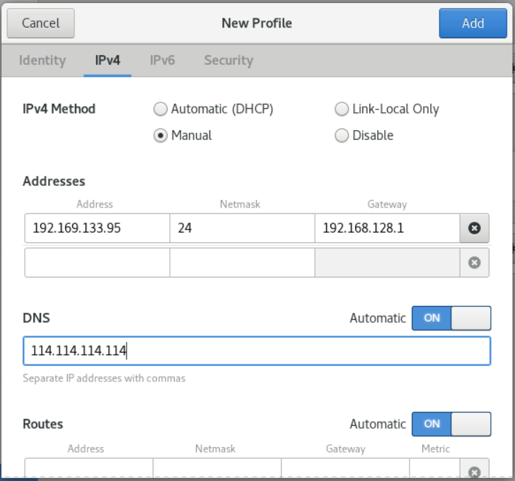
6. 在 IPv6 选项卡中，配置 IPv6 设置。例如，选择方法 Manual，设置静态 IPv6 地址、网络掩码、默认网关和 DNS 服务器：
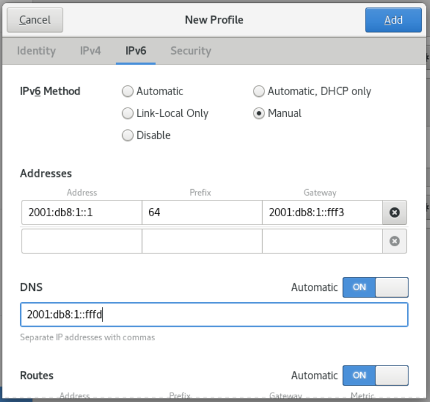
7. 点 Add 按钮保存连接。GNOME control-center 会自动激活连接。

**验证**

1. 显示设备和连接的状态：
    ```
    # nmcli device status
    DEVICE      TYPE      STATE      CONNECTION
    enp7s0      ethernet  connected  Example-Connection
    ```

2. 显示连接配置集的所有设置：
    ```
    # nmcli connection show Example-Connection
    connection.id:              Example-Connection
    connection.uuid:            b6cdfa1c-e4ad-46e5-af8b-a75f06b79f76
    connection.stable-id:       --
    connection.type:            802-3-ethernet
    connection.interface-name:  enp7s0
    ...
    ```

3. 使用 ping 程序来验证网络连通性。
    - 查找同一子网中的 IP 地址。
        IPv4:
            ```
            # ping 192.0.2.3
            ```
            IPv6:
            ```
            # ping 2001:db8:1::2
            ```
    - 在远程子网中查找 IP 地址。
        IPv4:
        ```
        # ping 192.0.2.3
        ```
        IPv6:
        ```
        # ping 2001:db8:2::1
        ```
        - 如果命令失败，则使用 ping 默认网关来验证设置。
            IPv4:
            ```
            # ping 192.0.2.254
            ```
            IPv6:
            ```
            # ping 2001:db8:1::fff3
            ```

4. 使用 host 命令验证域名解析是否正常：
    ```
    # host client.test.com
    ```
    如果命令错误，如 connection timed out 或 no servers could be reached，请验证您的 DNS 设置。

**故障排除步骤**
如果连接失败，或者网络接口在上线和关闭状态间切换：

- 确保网络电缆插入到主机和交换机。
- 检查连接失败是否只存在于这个主机上，或者其他连接到该服务器连接的同一交换机的主机中。
- 验证网络电缆和网络接口是否如预期工作。执行硬件诊断步骤并替换有缺陷的电缆和网络接口卡。
- 如果磁盘中的配置与设备中的配置不匹配，则启动或重启 NetworkManager 会创建一个代表该设备的配置的内存连接。

## 8.12.使用 nm-connection-editor 配置以太网连接

**前提条件**
- 服务器配置中有一个物理或者虚拟以太网设备。
- 已安装了 GNOME。

**流程**

1. 在终端输入：
    ```
    $ nm-connection-editor
    ```
2. 点 [+] 按钮添加新连接。
3. 选择 Ethernet 类型，然后单击 [Create]。
4. 在 General 选项卡中：
   1. 要在系统启动时或者重启 NetworkManager 服务时自动启用此连接：
      1. 选择 Connect automatically with priority 。
      2. 可选：更改 Connect automatically with priority 旁边的优先级值。

        如果同一设备有多个连接配置集，NetworkManager 只启用一个配置集。默认情况下，NetworkManager 激活启用了自动连接的最后使用的配置集。但是，如果您在配置集中设置了优先级值，NetworkManager 会以最高优先级激活配置集。
    2. 如果配置文件应该只对创建连接配置文件的用户可用，请清除 All users may connect to this network 复选框。
    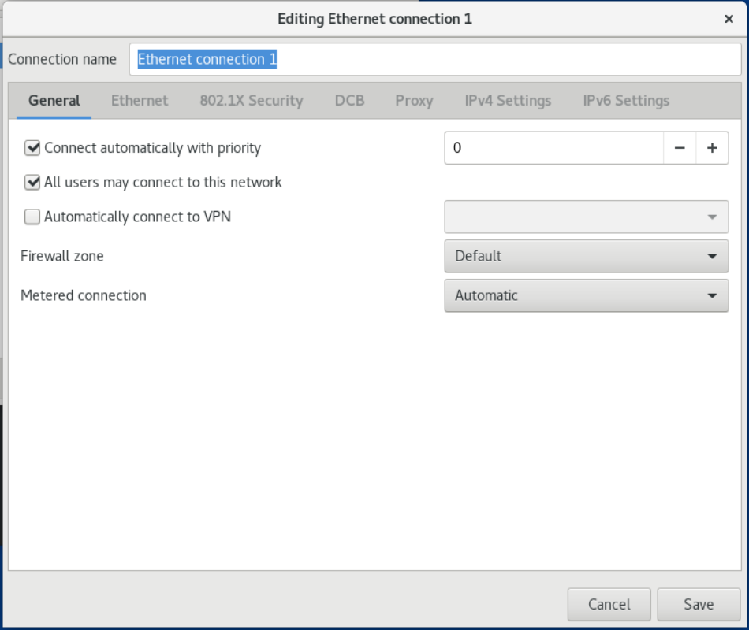
5. 在 Ethernet 选项卡中，选择一个设备，还可以选择与以太网相关的其他设置。

6. 在 IPv4 Settings 选项卡中，配置 IPv4 设置。例如，设置静态 IPv4 地址、网络掩码、默认网关和 DNS 服务器：
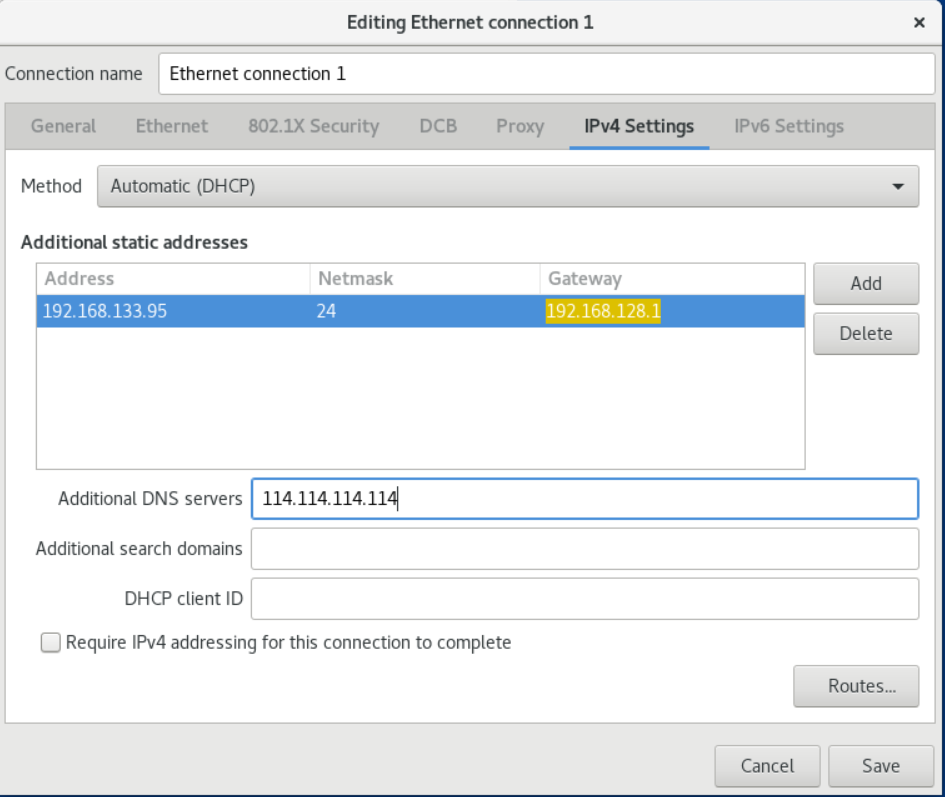
7. 在 IPv6 设置 选项卡上，配置 IPv6 设置。例如，设置静态 IPv6 地址、网络掩码、默认网关和 DNS 服务器：
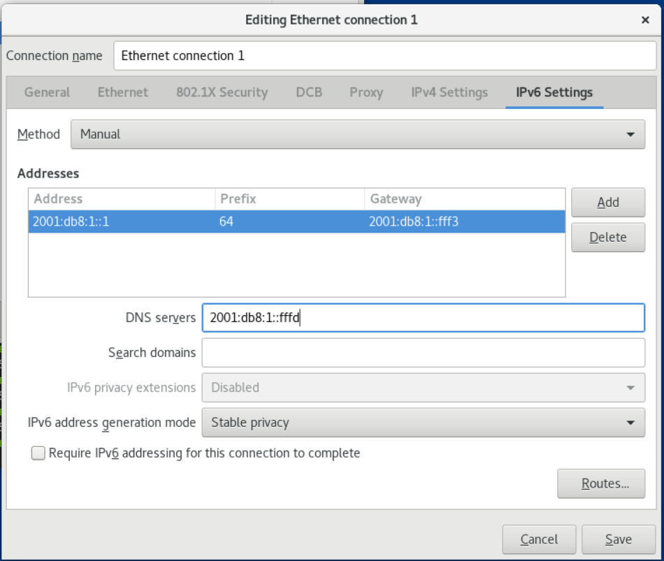
8. 保存连接。
9. 关闭 nm-connection-editor。

**验证**

1. 使用 ping 程序来验证网络连通性。
    - 查找同一子网中的 IP 地址。
        IPv4:
            ```
            # ping 192.0.2.3
            ```
            IPv6:
            ```
            # ping 2001:db8:1::2
            ```
    - 在远程子网中查找 IP 地址。
        IPv4:
        ```
        # ping 198.162.3.1
        ```
        IPv6:
        ```
        # ping 2001:db8:2::1
        ```
        - 如果命令失败，则使用 ping 默认网关来验证设置。
            IPv4:
            ```
            # ping 192.0.2.254
            ```
            IPv6:
            ```
            # ping 2001:db8:1::fff3
            ```

    - 使用 host 命令验证域名解析是否正常：
    ```
    # host client.test.com
    ```
    如果命令错误，如 connection timed out 或 no servers could be reached，请验证您的 DNS 设置。

## 8.13.更改 NetworkManager 的 DHCP 客户端

默认情况下，NetworkManager 使用其内部的 DHCP 客户端。但是，如果您需要不提供内置客户端的 DHCP 客户端，您也可以将 NetworkManager 配置为使用 dhclient。

**流程**

1. 创建 /etc/NetworkManager/conf.d/dhcp-client.conf 文件：
    ```
    [main]
    dhcp=dhclient
    ```
    您可以对 internal （默认）或 dhclient 设置 dhcp 参数。

2. 如果对 dhclient 设置 dhcp 参数，请安装 dhcp-client 软件包：
    ```
    # yum install dhcp-client
    ```

3. 重启 NetworkManager：
    ```
    # systemctl restart NetworkManager
    ```
    请注意，重启会临时中断所有网络连接。

**验证**

- 在 /var/log/messages 日志文件中搜索类似于如下的条目：
    ```
    Sep  5 06:41:52 server NetworkManager[27748]: <info>  [1650959659.8483] dhcp-init: Using DHCP client 'dhclient'
    ```
    此日志条目确认 NetworkManager 使用 dhclient 作为 DHCP 客户端。

## 8.14.配置 NetworkManager 连接的 DHCP 行为

DHCP 客户端在每次连接到网络时都从 DHCP 服务器请求动态 IP 地址和对应配置信息。

当您将连接配置为从 DHCP 服务器检索 IP 地址时，网络管理器（NetworkManager）从 DHCP 服务器请求 IP 地址。默认情况下，客户端会等待 45 秒时间完成此请求。当 DHCP 连接启动时，dhcp 客户端会从 DHCP 服务器请求 IP 地址。

**前提条件**

- 在主机上配置了使用 DHCP 的连接。

**流程**

1. 设置 ipv4.dhcp-timeout 和 ipv6.dhcp-timeout 属性。例如，要将这两个选项都设为 30 秒，请输入：
    ```
    # nmcli connection modify connection_name ipv4.dhcp-timeout 30 ipv6.dhcp-timeout 30
    ```
    另外，将参数设置为 infinity 以配置网络管理器(NetworkManager)不会停止尝试请求和续订 IP 地址，直到成功为止。

2. 可选：配置如果网络管理器（NetworkManager）在超时前没有接收 IPv4 地址时的行为：
    ```
    # nmcli connection modify connection_name ipv4.may-fail value
    ```
    如果将 ipv4.may-fail 选项设为：
    - yes ,连接的状态取决于 IPv6 配置：
      - 如果启用了 IPv6 配置并成功，NetworkManager 会激活 IPv6 连接，不再尝试激活 IPv4 连接。
      - 如果禁用或未配置 IPv6 配置，连接会失败。
    - no ,连接会被停止。在这种情况下：
      - 如果启用了连接的 autoconnect 属性，NetworkManager 会根据 autoconnect-retries 属性中设置的值尝试多次激活连接。默认值为 4。
      - 如果连接仍然无法获得 DHCP 地址，则自动激活会失败。请注意，5 分钟后，自动连接过程会再次启动，从 DHCP 服务器获取 IP 地址。

3. 可选：配置如果网络管理器（NetworkManager）在超时前没有接收 IPv6 地址时的行为：
    ```
    # nmcli connection modify connection_name ipv6.may-fail value
    ```

## 8.15.按接口名称使用单个连接配置文件配置多个以太网接口

在大多数情况下，一个连接配置文件包含一个网络设备的设置。但是，当您在连接配置文件中设置接口名称时，NetworkManager 也支持通配符。如果主机在具有动态 IP 地址分配的以太网之间漫游，则您可以使用此功能创建可用于多个以太网接口的单个连接配置文件。

**前提条件**

- DHCP 在网络中可用
- 主机有多个以太网适配器
- 主机上不存在连接配置文件

**流程**

1. 添加可应用于以 enp 开头的所有接口名称的连接配置文件：
    ```
    #nmcli connection add con-name Example connection.multi-connect multiple match.interface-name enp* type ethernet
    ```

**验证**

1. 显示单个连接配置文件的所有设置：
    ```
    #nmcli connection show Example
    connection.id:                      Example
    ...
    connection.multi-connect:           3 (multiple)
    match.interface-name:               `enp*`
    ...
    ```
    3 表示**同时在连接配置文件上处于活动状态的接口数量**，而不是连接配置文件中的网络接口数量。连接配置文件使用与 match.interface-name 参数中的模式匹配的所有设备，因此连接配置文件具有相同的通用唯一识别符(UUID)。

2. 显示连接的状态：
    ```
    #nmcli connection show
    NAME                    UUID                    TYPE     DEVICE
    ...
    Example  6f22402e-c0cc-49cf-b702-eaf0cd5ea7d1  ethernet  enp7s0
    Example  6f22402e-c0cc-49cf-b702-eaf0cd5ea7d1  ethernet  enp8s0
    Example  6f22402e-c0cc-49cf-b702-eaf0cd5ea7d1  ethernet  enp9s0
    ```

## 8.16.使用 PCI ID 为多个以太网接口配置一个连接配置文件

PCI ID 是连接到系统的设备的唯一标识符。连接配置文件根据 PCI ID 列表按匹配的接口来添加多个设备。您可以使用这个流程将多个设备 PCI ID 连接到一个连接配置文件。

**前提条件**

- DHCP 服务器在网络中可用
- 主机有多个以太网适配器
- 系统上不存在连接配置文件

**流程**

1. 识别设备路径。例如，要显示以 enp 开头的所有接口的设备路径，请输入：
    ```
    #udevadm info /sys/class/net/enp* | grep ID_PATH=
    ...
    E: ID_PATH=pci-0000:07:00.0
    E: ID_PATH=pci-0000:08:00.0
    ```

2. 添加可应用于匹配 0000:00:0[7-8].0 表达式的所有 PCI ID 的连接配置文件：
    ```
    #nmcli connection add type ethernet connection.multi-connect multiple match.path "pci-0000:07:00.0 pci-0000:08:00.0" con-name Example
    ```

**验证**

1. 显示连接的状态：
    ```
    #nmcli connection show

    NAME   UUID     TYPE        DEVICE
    ...
    Example      9cee0958-512f-4203-9d3d-b57af1d88466  ethernet  enp7s0
    Example      9cee0958-512f-4203-9d3d-b57af1d88466  ethernet  enp8s0
    ...
    ```

2. 显示连接配置集的所有设置：
    ```
    #nmcli connection show Example

    connection.id:               Example
    ...
    connection.multi-connect:    3 (multiple)
    match.path:                  pci-0000:07:00.0,pci-0000:08:00.0
    ...
    ```

此连接配置文件使用 PCI ID 与 match.path 参数中的模式匹配的所有设备，因此连接配置文件具有相同的全局唯一标识符(UUID)。

# 第9章 管理 Wi-Fi 连接

## 9.1.使用 nmcli 配置 Wi-Fi 连接

**前提条件**

- 安装了 nmcli 工具。
- 确保 WiFi 被启用:
    ```
    $ nmcli radio wifi on
    ```

**流程**

1. 使用静态 IP 配置创建 Wi-Fi 连接配置集：
    ```markdown
    $ nmcli con add con-name MyCafe ifname wlan0 type wifi ssid MyCafe ip4 192.0.2.101/24 gw4 192.0.2.1
    ```

2. 设置一个 DNS 服务器。例如，将 192.0.2.1 设为 DNS 服务器：
    ```markdown
    $ nmcli con modify con-name MyCafe ipv4.dns "192.0.2.1"
    ```

3. 另外，还可设置 DNS 搜索域。例如，要将搜索域设为 example.com ：
    ```
    $ nmcli con modify con-name MyCafe ipv4.dns-search "example.com"
    ```

4. 检查特定属性，如 mtu ：
    ```
    $ nmcli connection show id MyCafe | grep mtu
    802-11-wireless.mtu:                     auto
    ```

5. 更改设置的属性：
    ```
    $ nmcli connection modify id MyCafe wireless.mtu 1350
    ```

6. 验证更改：
    ```
    $ nmcli connection show id MyCafe | grep mtu
    802-11-wireless.mtu:                     1350
    ```

**验证**

1. 使用 ping 命令验证 wifi 网络是否连通：
    - 同一子网：
        ```
        # ping 192.0.2.103
        ```
        如果命令失败，请验证 IP 和子网的设置。
    - 外网：
        ```
        # ping 198.51.16.3
        ```
        - 如果命令失败，则使用 ping 默认网关来验证设置。
            ```
            # ping 192.0.2.1
            ```

2. 使用 host 命令验证域名解析是否正常。
    ```
    # host client.example.com
    ```
    如果命令返回任何错误，如 connection timed out 或 no servers could be reached，请验证您的 DNS 设置。

## 9.2.使用 control-center 配置 Wi-Fi 连接

**流程**

1. 进入设置 Settings 并在左侧菜单栏中选择 WI-FI 选项即可看到可用的 Wi-Fi 网络。
2. 选择您要编辑的 Wi-Fi 连接名称右侧的 gear wheel 图标，并会出现编辑连接对话框。Details 菜单窗口显示您可以进行进一步配置的连接详情。

    **选项**

    1. 如果您选择" 自动连接 "，当NetworkManager 检测到可用时，NetworkManager 会自动连接到这个连接。如果您不希望 NetworkManager 自动连接，请清除复选框。请注意，当复选框清除时，您必须在网络连接图标的菜单中选择该连接使其连接。
    2. 要使连接可供其他用户使用，请选中 Make available to other users 复选框。
    3. 您还可以通过更改 Restrict background data usage 来控制后台数据的使用。
3. 选择 Identity 菜单项来查看基本配置选项。
   SSID - 接入点(AP) 的服务集合标识符 (SSID)。

   BSSID - 基本服务集合标识符 (BSSID)是您在 基础架构 模式中连接的特定无线访问点的 MAC 地址（也称为 硬件地址 ）。默认情况下，此字段为空白，您可以通过 SSID 连接到无线访问点，而无需指定 BSSID。如果指定了 BSSID，它将强制系统只关联到特定的接入点。对于临时网络，在创建 ad-hoc 网络时，BSSID 由 mac80211 子系统随机生成。网络管理器（NetworkManager）不显示它。

   MAC 地址 - MAC 地址 允许您将特定的无线适配器与特定连接（或连接）关联。

   克隆地址 - 使用克隆的 MAC 地址代替实际硬件地址。保留空白，除非需要。
4. 要进行进一步的 IP 地址配置，请选择 IPv4 和 IPv6 菜单项。
   
   默认情况下，根据当前的网络设置，IPv 4 和 IPv6 都被设置为自动配置。这意味着，当接口连接到网络时，会自动检测到本地 IP 地址、DNS 地址和其他设置。如果 DHCP 服务器在此网络中分配 IP 配置，但您也可以在 IPv4 和 IPv 6 设置中提供静态配置。在 IPv4 和 IPv6 菜单条目中，您可以看到以下设置：

   - IPv4
     - 自动(DHCP) - 如果您要连接的网络使用路由器公告(RA)或 DHCP 服务器来分配动态 IP 地址，请选择此选项。您可以在 Details 菜单条目中看到分配的 IP 地址。
     - 仅链接 - 如果您要连接的网络没有 DHCP 服务器且您不想手动分配 IP 地址，请选择这个选项。随机地址将根据 RFC 3927 分配前缀 169.254/16。
     - Manual - 如果要手动分配 IP 地址，请选择这个选项。
     - disable - 此连接禁用 IPv4。
   - DNS
     - 如果 Automatic 为 ON，并且没有可用的 DHCP 服务器为此连接分配 DNS 服务器，请将其切换到 OFF，以输入用逗号分隔 IP 的 DNS 服务器的 IP 地址。
   - Routes

        请注意，在 Routes 部分，当 Automatic 为 ON 时，会使用来自路由器公告(RA)或 DHCP 的路由，但您也可以添加额外的静态路由。OFF 时，仅使用静态路由。
     - 地址 - 输入远程网络、子网络或主机的 IP 地址。
     - 子网掩码 - 上面输入的 IP 地址的子网掩码或前缀长度。
     - 网关 - 上面输入的远程网络、子网络或主机的网关的 IP 地址。
     - 指标 - 网络成本，赋予此路由的首选值。数值越低，优先级越高。
   - 仅将此连接用于其网络上的资源
     - 选择这个复选框以防止连接成为默认路由。
   - IPv6
     - 自动 - 选择此选项以使用 IPv6 无状态地址自动配置(SLAAC)，基于硬件地址和路由器公告(RA)创建自动无状态配置。
     - 自动，仅 DHCP - 选择此选项以不使用 RA，而是直接从 DHCPv6 请求信息以创建有状态配置。
     - 仅链接 - 如果您要连接的网络没有 DHCP 服务器且您不想手动分配 IP 地址，请选择这个选项。随机地址将根据 RFC 4862 进行分配，前缀为 FE80::0。
     - Manual - 如果要手动分配 IP 地址，请选择这个选项。
     - disable - 此连接禁用 IPv6。
5. 选择 Security 菜单条目配置安全设置。
    - 安全性
      - None - 禁用加密，数据在网络中以纯文本形式传输。
      - WEP 40/128 位密钥 - Wired Equivalent Privacy(WEP)，来自于 IEEE 802.11 标准。使用单一预共享密钥（PSK）。
      - WEP 128 位密码 - 用于 生成 WEP 密钥的密码短语的 MD5 哈希。
      - 动态 WEP(802.1X) - WEP 密钥动态更改.
      - LEAP - Cisco 系统的轻量级可扩展身份验证协议.
      - WPA 和 WPA2 个人 - Wi-Fi Protected Access(WPA)，来自 IEEE 802.11i 标准草案.来自 802.11i-2004 标准的 Wi-Fi Protected Access 2(WPA2)。个人模式，使用预共享密钥（WPA-PSK）。
      - WPA & WPA2 Enterprise — WPA 和 WPA 2 用于与 RADIUS 身份验证服务器一起使用，以提供 IEEE 802.1X 网络访问控制。
      - WPA3 Personal - Wi-Fi Protected Access 3(WPA3) Personal 使用 Simultaneous Authentication of Equals(SAE)而不是预共享密钥(PSK)来防止字典攻击。WPA3 使用完美转发保密。
    - 密码
      - 输入要在验证过程中使用的密码。
6. 完成配置后，点 应用 按钮保存配置。

## 9.3.使用 nmcli 连接到 Wi-Fi 网络

**前提条件**

- 安装了 nmcli 工具。
- 确保 WiFi 被启用（默认）:
    ```
    $ nmcli radio wifi on
    ```

**流程**

1. 刷新可用的 Wi-Fi 连接列表：
    ```
    $ nmcli device wifi rescan
    ```

2. 查看可用的 Wi-Fi 接入点：
    ```
    $ nmcli dev wifi list

    IN-USE  SSID      MODE   CHAN  RATE        SIGNAL  BARS  SECURITY
    ...
            MyCafe    Infra  3     405 Mbit/s  85      ▂▄▆█  WPA1 WPA2
    ```

3. 使用 nmcli 连接到 Wi-Fi 连接：
    ```
    $ nmcli dev wifi connect SSID-Name password wireless-password
    ```
    例如：
    ```
    $ nmcli dev wifi connect MyCafe password wireless-password
    ```
    禁用 Wi-Fi ：
    ```
    $ nmcli radio wifi off
    ```

## 9.4.使用 nmcli 连接到隐藏的 Wi-Fi 网络

所有 Wi-Fi 接入点都有一个 Service Set Identifier（SSID）来识别它们。然而，接入点可以被配置为不广播其 SSID，在这种情况下，它会被隐藏，且不会出现在网络管理器（NetworkManager）的可用网络列表中。

**前提条件**

- 安装了 nmcli 工具。
- 了解 SSID，以及 Wi-Fi 连接的密码。
- 确保 WiFi 被启用（默认）:
    ```
    $ nmcli radio wifi on
    ```

**流程**

- 连接到隐藏的 SSID：
    ```
    $ nmcli dev wifi connect SSID_Name password wireless_password hidden yes
    ```

## 9.5.使用 GNOME GUI 连接至 Wi-Fi 网络

**流程**

1. 在屏幕右上角打开 GNOME Shell 网络连接图标菜单。
2. 选择 Wi-Fi Not Connected。
3. 单击 Select Network 选项。
4. 单击您要连接的网络名称，然后单击 Connect。
   请注意，如果没有看到网络，则网络可能是隐藏的。
5. 如果需要密码或加密密钥保护网络，请输入密码并单击" 连接 "。
   请注意：如果您不知道密码，请联络 Wi-Fi 网络的管理员。
6. 如果连接成功，则会在连接图标菜单中看到网络连接，WiFi图标位于屏幕右上角。

## 9.6.使用 nmcli 在现有 Wi-Fi 连接中配置 802.1X 网络身份验证

使用 nmcli 工具，您可以配置网络身份验证。此流程描述了如何在现有名为 wlp1s0 的 NetworkManager Wi-Fi 连接配置文件中使用 Microsoft Challenge-Handshake Authentication Protocol 版本 2(MSCHAPv2)配置受保护的扩展验证协议(PEAP)身份验证。

**前提条件**

1. 网络必须具有 802.1X 网络身份验证。
2. Wi-Fi 连接配置集存在于 NetworkManager 中，且具有有效的 IP 配置。
3. 如果需要客户端验证验证方的证书，则证书颁发机构(CA)证书必须存储在 /etc/pki/ca-trust/source/anchors/ 目录中。
4. wpa_supplicant 软件包已安装。

**流程**

1. 将 Wi-Fi 安全模式设为 wpa-eap、将可扩展验证协议(EAP)设为 peap，将内部验证协议设为 mschapv2，设置用户名：
    ```
    # nmcli connection modify wlp1s0 wireless-security.key-mgmt wpa-eap 802-1x.eap peap 802-1x.phase2-auth mschapv2 802-1x.identity user_name
    ```
    请注意，您必须在单个命令中设置 wireless-security.key-mgmt、802-1x.eap、802-1x.phase2-auth 和 802-1x.identity 参数。

2. 另外，还可将该密码存储在配置中：
    ```
    # nmcli connection modify wlp1s0 802-1x.password password
    ```

    默认情况下，NetworkManager 在 /etc/sysconfig/network-scripts/keys-connection_name 文件中以明文形式保存密码，该文件只对 root 用户可读。但是，在配置文件中清除文本密码会有安全隐患。

    要提高安全性，请将 802-1x.password-flags 参数设为 0x1。有了这个设置，在具有 GNOME 桌面环境或运行 nm-applet 的服务器上，NetworkManager 从这些服务中检索密码。在其他情况下，NetworkManager 会提示输入密码。

3. 如果需要客户端验证验证方的证书，请将连接配置文件中的 802-1x.ca-cert 参数设为 CA 证书的路径：
    ```
    # nmcli connection modify wlp1s0 802-1x.ca-cert /etc/pki/ca-trust/source/anchors/ca.crt
    ```

4. 激活连接配置集：
    ```
    # nmcli connection up wlp1s0
    ```

# 第 10 章 配置 VLAN 标记

本章论述了如何配置虚拟本地区域网络（VLAN）。VLAN 是物理网络中的一个逻辑网络。当数据包通过 VLAN 接口时会带上接口标记和 VLAN ID ，数据包返回时则会删除标记。

您可以在另一个接口（如以太网、绑定、team 或桥接设备）上创建 VLAN 接口。此接口称为父接口。

## 10.1.使用 nmcli 命令配置 VLAN 标记

**前提条件**

- 您计划用作虚拟 VLAN 接口的父接口支持 VLAN 标记。
- 如果您在绑定接口之上配置 VLAN：
  - 绑定的端口是在线的。
  - 这个绑定没有使用 fail_over_mac=follow 选项进行配置。VLAN 虚拟设备无法更改其 MAC 地址以匹配父设备的新 MAC 地址。在这种情况下，流量仍会使用不正确的源 MAC 地址发送。
  - 这个绑定通常不会预期从 DHCP 服务器或 IPv6 自动配置获取 IP 地址。在创建绑定时设置 ipv4.method=disable 和 ipv6.method=ignore 选项。否则，如果 DHCP 或 IPv6 自动配置在一段时间后失败，接口可能会关闭。
- 主机连接到的交换机被配置为支持 VLAN 标记。详情请查看您的交换机说明。

**流程**

1. 显示网络接口：
    ```
    # nmcli device status
    DEVICE   TYPE      STATE         CONNECTION
    enp1s0   ethernet  disconnected  enp1s0
    bridge0  bridge    connected     bridge0
    bond0    bond      connected     bond0
    ...
    ```

2. 创建 VLAN 接口。例如，要创建一个使用 enp1s0 作为其父接口，使用 VLAN ID 10 标记数据包，名为 vlan10 的 VLAN 接口，请输入：
    ```
    # nmcli connection add type vlan con-name vlan10 ifname vlan10 vlan.parent enp1s0 vlan.id 10
    ```
    请注意，VLAN 必须在范围 0 到 4094 之间。

3. 默认情况下，VLAN 连接会继承上级接口的最大传输单元（MTU）。另外，还可设置不同的 MTU 值：
    ```
    # nmcli connection modify vlan10 ethernet.mtu 2000
    ```

4. 配置 VLAN 设备的 IP 设置。如果要使用这个 VLAN 设备作为其它设备的端口，请跳过这一步。
   1. 配置 IPv4 设置。例如，要对 vlan10 连接设置静态 IPv4 地址、网络掩码、默认网关和 DNS 服务器设置，请输入：
        ```
        # nmcli connection modify vlan10 ipv4.addresses '192.0.2.1/24'
        # nmcli connection modify vlan10 ipv4.gateway '192.0.2.254'
        # nmcli connection modify vlan10 ipv4.dns '192.0.2.253'
        # nmcli connection modify vlan10 ipv4.method manual
        ```

    2. 配置 IPv6 设置。例如，要对 vlan10 连接设置静态 IPv6 地址、网络掩码、默认网关和 DNS 服务器设置，请输入：
        ```
        # nmcli connection modify vlan10 ipv6.addresses '2001:db8:1::1/32'
        # nmcli connection modify vlan10 ipv6.gateway '2001:db8:1::fffe'
        # nmcli connection modify vlan10 ipv6.dns '2001:db8:1::fffd'
        # nmcli connection modify vlan10 ipv6.method manual
        ```

5. 激活连接：
    ```
    # nmcli connection up vlan10
    ```

**验证**

- 验证配置：
    ```
    # ip -d addr show vlan10
    4: vlan10@enp1s0: <BROADCAST,MULTICAST,UP,LOWER_UP> mtu 1500 qdisc noqueue state UP group default qlen 1000
        link/ether 52:54:00:72:2f:6e brd ff:ff:ff:ff:ff:ff promiscuity 0
        vlan protocol 802.1Q id 10 <REORDER_HDR> numtxqueues 1 numrxqueues 1 gso_max_size 65536 gso_max_segs 65535
        inet 192.0.2.1/24 brd 192.0.2.255 scope global noprefixroute vlan10
        valid_lft forever preferred_lft forever
        inet6 2001:db8:1::1/32 scope global noprefixroute
        valid_lft forever preferred_lft forever
        inet6 fe80::8dd7:9030:6f8e:89e6/64 scope link noprefixroute
        valid_lft forever preferred_lft forever
    ```

## 10.2.使用 nm-connection-editor 配置 VLAN 标记

**前提条件**

- 您计划用作虚拟 VLAN 接口的父接口支持 VLAN 标记。
- 如果您在绑定接口之上配置 VLAN：
  - 绑定的端口是在线的。
  - 这个绑定没有使用 fail_over_mac=follow 选项进行配置。VLAN 虚拟设备无法更改其 MAC 地址以匹配父设备的新 MAC 地址。在这种情况下，流量仍会使用不正确的源 MAC 地址发送。
- 主机连接到的交换机被配置为支持 VLAN 标记。详情请查看您的交换机说明。

**流程**

1. 打开终端，输入 nm-connection-editor ：
    ```
    $ nm-connection-editor
    ```

2. 点击 + 按钮来添加一个新的连接。
3. 选择 VLAN 连接类型，然后单击 Create。
4. 在 VLAN 选项卡中：
   1. 选择上级接口。
   2. 选择 VLAN ID。请注意，VLAN 必须在范围 0 到 4094 之间。
   3. 默认情况下，VLAN 连接会继承上级接口的最大传输单元（MTU）。另外，还可设置不同的 MTU 值。
   4. 另外，还可设置 VLAN 接口的名称以及其它特定 VLAN 选项。
   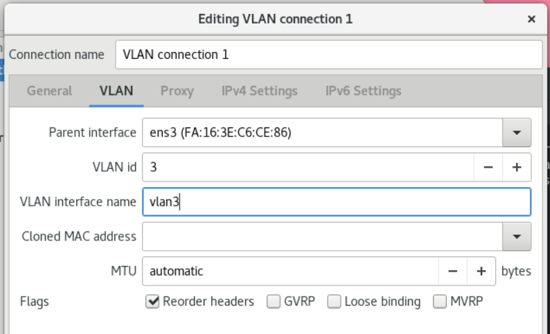
5. 配置 VLAN 设备的 IP 设置。如果要使用这个 VLAN 设备作为其它设备的端口，请跳过这一步。
   1. 在 IPv4 Settings 选项卡中，配置 IPv4 设置。例如，设置静态 IPv4 地址、网络掩码、默认网关和 DNS 服务器：
   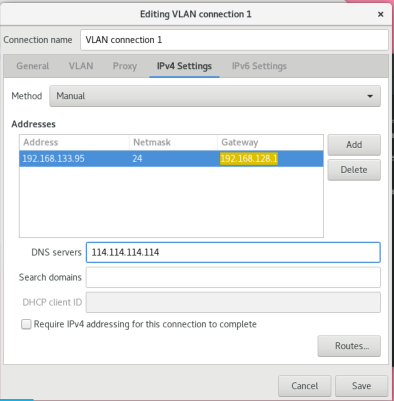
   2. 在 IPv6 设置 选项卡上，配置 IPv6 设置。例如，设置静态 IPv6 地址、网络掩码、默认网关和 DNS 服务器：
   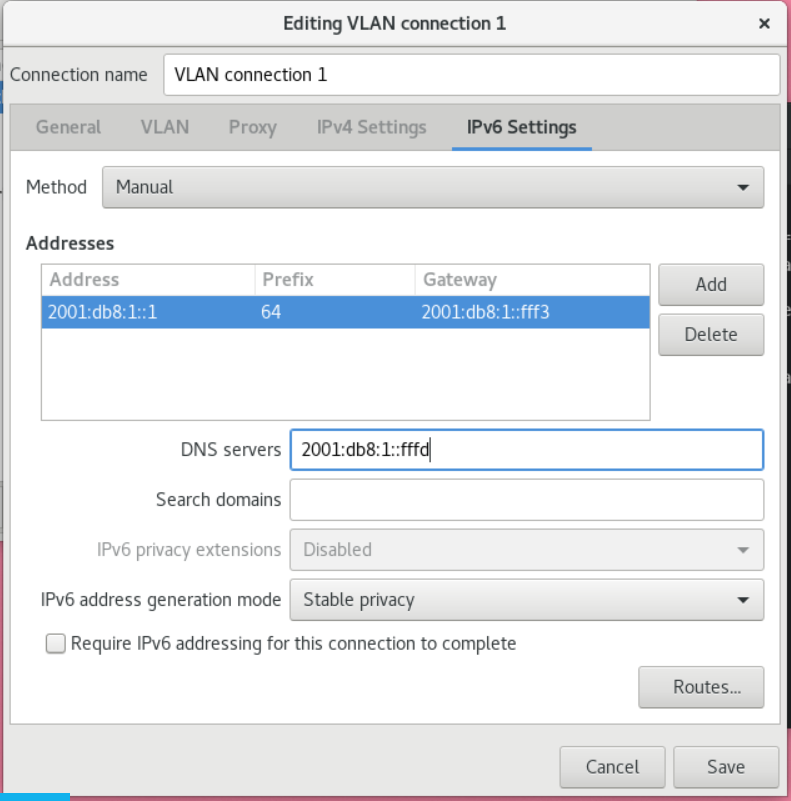
6. 点击 Save 保存 VLAN 连接。
7. 关闭 nm-connection-editor。

**验证**

1. 验证配置：
    ```
    # ip -d addr show vlan3
    4: vlan3@ens3: <BROADCAST,MULTICAST,UP,LOWER_UP> mtu 1500 qdisc noqueue state UP group default qlen 1000
        link/ether 52:54:00:d5:e0:fb brd ff:ff:ff:ff:ff:ff promiscuity 0
        vlan protocol 802.1Q id 10 <REORDER_HDR> numtxqueues 1 numrxqueues 1 gso_max_size 65536 gso_max_segs 65535
        inet 192.0.2.1/24 brd 192.0.2.255 scope global noprefixroute vlan10
        valid_lft forever preferred_lft forever
        inet6 2001:db8:1::1/32 scope global noprefixroute
        valid_lft forever preferred_lft forever
        inet6 fe80::8dd7:9030:6f8e:89e6/64 scope link noprefixroute
        valid_lft forever preferred_lft forever
    ```

## 10.3. 使用 nmstatectl 配置 VLAN 标记

本节描述了如何使用 nmstatectl 工具配置使用以太网连接、 ID 为 10 的 VLAN。作为子设备，VLAN 连接包含 IP、默认网关和 DNS 配置。

根据您的环境，相应地调整 YAML 文件。例如，要在 VLAN 中使用网桥或绑定设备，请调整您在 VLAN 中使用的端口的 base-iface 属性和 type 属性。

**前提条件**

- 要将以太网设备用作 VLAN 中的端口，必须在服务器中安装物理或者虚拟以太网设备。
- nmstate 软件包已安装。

**流程**

1. 创建YAML文件包含以下内容，~/create-vlan.yml ：
    ```
    ---
    interfaces:
    - name: vlan10
    type: vlan
    state: up
    ipv4:
        enabled: true
        address:
        - ip: 192.0.2.1
        prefix-length: 24
        dhcp: false
    ipv6:
        enabled: true
        address:
        - ip: 2001:db8:1::1
        prefix-length: 64
        autoconf: false
        dhcp: false
    vlan:
        base-iface: enp1s0
        id: 10
    - name: enp1s0
    type: ethernet
    state: up

    routes:
    config:
    - destination: 0.0.0.0/0
        next-hop-address: 192.0.2.254
        next-hop-interface: vlan10
    - destination: ::/0
        next-hop-address: 2001:db8:1::fffe
        next-hop-interface: vlan10

    dns-resolver:
    config:
        search:
        - example.com
        server:
        - 192.0.2.200
        - 2001:db8:1::ffbb
    ```

2. 将设置应用到系统：
    ```
    # nmstatectl apply ~/create-vlan.yml
    ```

**验证**

1. 显示设备和连接的状态：
    ```
    # nmcli device status
    DEVICE      TYPE      STATE      CONNECTION
    vlan10      vlan      connected  vlan10
    ```
2. 显示连接配置集的所有设置：
    ```
    # nmcli connection show vlan10
    connection.id:              vlan10
    connection.uuid:            1722970f-788e-4f81-bd7d-a86bf21c9df5
    connection.stable-id:       --
    connection.type:            vlan
    connection.interface-name:  vlan10
    ...
    ```
3. 以 YAML 格式显示连接设置：
    ```
    # nmstatectl show vlan0
    ```

## 10.4.使用 rhel-system-roles 配置 VLAN 标记

本节描述了如何在这个以太网连接之上添加以太网连接 ID 为 10 的 VLAN 。作为子设备，VLAN 连接包含 IP、默认网关和 DNS 配置。

根据您的环境，相应地调整。例如：

若要将 VLAN 用作其他连接中的端口（如绑定），请省略 ip 属性，并在子配置中设置 IP 配置。
若要在 VLAN 中使用 team、bridge 或 bond 设备，请调整您在 VLAN 中使用的端口的 interface_name 和 类型 属性。

**前提条件**

- ansible 和 rhel-system-roles 软件包已安装在控制节点上。
- 如果您在运行 playbook 时使用了非 root 用户，则确保此用户在节点上具有 sudo 权限。

**流程**

1. 如果您要在其上执行 playbook 中指令的主机还没有被列入清单，请将此主机的 IP 或名称添加到 /etc/ansible/hosts Ansible 清单文件中：
    ```
    node.example.com
    ```
2. 使用以下内容创建 ~/vlan-ethernet.yml playbook：
    ```
    ---
   - name: Configure a VLAN that uses an Ethernet connection
     hosts: node.example.com
     become: true
     tasks:
     - include_role:
         name: rhel-system-roles.network

       vars:
         network_connections:
           # Add an Ethernet profile for the underlying device of the VLAN
           - name: enp1s0
             type: ethernet
             interface_name: enp1s0
             autoconnect: yes
             state: up
             ip:
               dhcp4: no
               auto6: no

           # Define the VLAN profile
           - name: enp1s0.10
             type: vlan
             ip:
               address:
                 - "192.0.2.1/24"
                 - "2001:db8:1::1/64"
               gateway4: 192.0.2.254
               gateway6: 2001:db8:1::fffe
               dns:
                 - 192.0.2.200
                 - 2001:db8:1::ffbb
               dns_search:
                 - example.com
             vlan_id: 10
             parent: enp1s0
             state: up
    ```
    VLAN 配置文件中的 parent 属性将 VLAN 配置为在 enp1s0 设备之上运行。
3. 运行 playbook：
    - 要以 root 用户身份连接到受管主机，请输入：
        ```
        # ansible-playbook -u root ~/vlan-ethernet.yml
        ```
    - 以用户身份连接到受管主机，请输入：
        ```
        # ansible-playbook -u user_name --ask-become-pass ~/vlan-ethernet.yml
        ```
        --ask-become-pass 选项确保 ansible-playbook 命令提示输入 -u user_name 选项中定义的用户的 sudo 密码。
    如果没有指定 -u user_name 选项，ansible-playbook 以当前登录到控制节点的用户身份连接到受管主机。

# 第 11 章 使用 VXLAN 为虚拟机创建虚拟第 2 层域

虚拟可扩展局域网(VXLAN)是一种网络协议，它使用 UDP 协议在 IP 网络上对第 2 层流量进行隧道化。例如，在不同主机上运行的某些虚拟机(VM)可以通过 VXLAN 隧道进行通信。主机可以位于不同的子网中，甚至位于世界各地的不同数据中心。从虚拟机的角度来看，同一 VXLAN 中的其他虚拟机都在同一个第 2 层域中。

本文档描述了如何在 OpenCLoudOS 主机上配置虚拟机不可见的 VXLAN ：
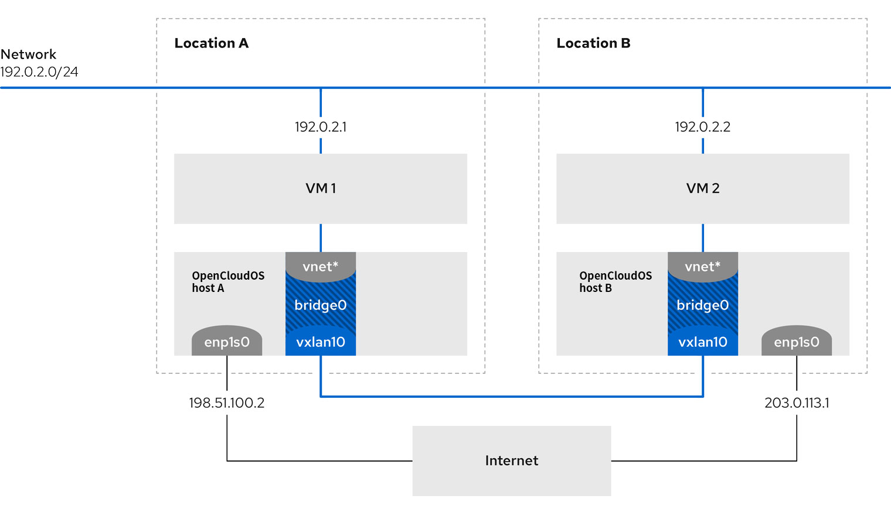

在本例中，OpenCloudOS-host-A 和 OpenCloudOS-host-B 使用网桥 br0 来在每台具有 VXLAN 为 vxlan10 的主机上连接虚拟机的虚拟网络。由于此配置，VXLAN 对虚拟机不可见，虚拟机不需要任何特殊的配置。如果您稍后将更多的虚拟机连接到同一虚拟网络，则虚拟机将自动成为同一虚拟第 2 层域的成员。

就像正常的第 2 层流量一样，VXLAN 中的数据是不加密的。出于安全考虑，在 VPN 或其他类型的加密连接上使用 VXLAN 。

## 11.1.VXLAN 的优点

虚拟可扩展局域网(VXLAN)提供了以下主要优点：

- VXLAN 使用 24 位 ID。因此，您可以创建高达 16,777,216 个隔离网络。例如，虚拟 LAN(VLAN)只支持 4,096 个隔离网络。
- VXLAN 使用 IP 协议。这可让您通过路由控制流量，并在同一第 2 层域中的不同网络和位置虚拟运行系统。
- 与大多数隧道协议不同，VXLAN 不仅仅是一个点对点的网络。VXLAN 可以动态了解其他端点的 IP 地址，也可以使用静态配置的转发条目。
- 某些网卡支持 UDP 隧道相关的卸载功能。

## 11.2.在主机上配置以太网接口

要将 OpenCloudOS 虚拟机主机连接到以太网，请创建一个网络连接配置文件，配置 IP 设置，并激活配置文件。

在 OpenCloudOS 主机上运行此过程，并相应地调整 IP 地址配置。

**前提条件**

- 主机连接到以太网主机。

**流程**

1. 在 NetworkManager 中添加新的以太网连接配置文件：
    ```
    # nmcli connection add con-name Example ifname enp1s0 type ethernet
    ```
2. 配置 IPv4 设置：
    ```
    # nmcli connection modify Example ipv4.addresses 198.51.100.2/24 ipv4.method manual ipv4.gateway 198.51.100.254 ipv4.dns 198.51.100.200 ipv4.dns-search example.com
    ```
    如果网络使用 DHCP，请跳过这一步。
3. 激活 Example 连接：
    ```
    # nmcli connection up Example
    ```

**验证**

1. 显示设备和连接的状态：
    ```
    # nmcli device status
    DEVICE      TYPE      STATE      CONNECTION
    enp1s0      ethernet  connected  Example
    ```
2. 在远程网络中 ping 主机以验证 IP 设置：
    ```
    # ping OpenCloudOS-host-B.example.com
    ```
    请注意，在该主机上配置网络前，您无法 ping 其他虚拟机主机。

## 11.3.创建附加了 VXLAN 的网桥

要使虚拟可扩展局域网(VXLAN)对虚拟机(VM)不可见，请在主机上创建一个网桥，并将 VXLAN 附加给网桥。使用 NetworkManager 创建网桥和 VXLAN。您不能将虚拟机的任何流量访问点(TAP)设备（通常在主机上称为 vnet *）添加到网桥。在虚拟机启动时，libvirtd 服务会动态添加它们。

在 OpenCloudOS 主机上运行此过程，并相应地调整 IP 地址。

**流程**

1. 创建网桥 br0 ：
    ```
    # nmcli connection add type bridge con-name br0 ifname br0 ipv4.method disabled ipv6.method disabled
    ```
    此命令在网桥设备上设置没有 IPv4 和 IPv6 地址，因为此网桥在第 2 层工作。
2. 创建 VXLAN 接口，并将其附加到 br0 ：
    ```
    # nmcli connection add type vxlan slave-type bridge con-name br0-vxlan10 ifname vxlan10 id 10 local 198.51.100.2 remote 203.0.113.1 master br0
    ```
    这个命令使用以下设置：
        - ID 10 ：设置 VXLAN 标识符。
        - local 198.51.100.2 ：设置传出数据包的源 IP 地址。
        - remote 203.0.113.1 ：当目的地链路层地址在 VXLAN 设备转发数据库中未知时，设置要在传出数据包中使用的单播或多播IP地址。
        - remote 203.0.113.1 ：当目的地链路层地址在 VXLAN 设备转发数据库中未知时，设置要在传出数据包中使用的单播或多播IP地址。
        - ipv4.method disabled 和 ipv6.method disabled: 在网桥上禁用 IPv4 和 IPv6。
3. 激活 br0 连接配置文件：
    ```
    # nmcli connection up br0
    ```
4. 在本地防火墙中为进入 UDP 连接打开端口 8472 ：
    ```
    # nmcli connection up br0
    ```

**验证**

- 显示转发表：
    ```
    # bridge fdb show dev vxlan10
    2a:53:bd:d5:b3:0a master br0 permanent
    00:00:00:00:00:00 dst 203.0.113.1 self permanent
    ...
    ```

## 11.4.在带有现有网桥的 libvirt 中创建一个虚拟网络

要使虚拟机(VM)使用带有附加虚拟可扩展局域网(VXLAN) 的 br0 网桥，首先将虚拟网络添加到使用此网桥的 libvirtd 服务中。

**前提条件**

- 您已安装了 libvirt 软件包。
- 您已安装了 libvirt 软件包。
- 您已在 OpenCloudOS 上配置了带有 VXLAN 的 br0 设备。

**流程**

1. 使用以下内容创建 ~/vxlan10-bridge.xml 文件：
    ```
    <network>
    <name>vxlan10-bridge</name>
    <forward mode="bridge" />
    <bridge name="br0" />
    </network>
    ```
2. 使用 ~/vxlan10-bridge.xml 文件来在 libvirt 中创建一个新的虚拟网络：
    ```
    # virsh net-define ~/vxlan10-bridge.xml
    ```
3. 删除 ~/vxlan10-bridge.xml 文件：
    ```
    # rm ~/vxlan10-bridge.xml
    ```
4. 启动 vxlan10-bridge 虚拟网络：
    ```
    # virsh net-start vxlan10-bridge
    ```
5. 将 vxlan10-bridge 虚拟网络配置为在 libvirtd 服务启动时自动启动：
    ```
    # virsh net-autostart vxlan10-bridge
    ```

**验证**

- 显示虚拟网络列表：
    ```
    # virsh net-list
    Name              State    Autostart   Persistent
    ----------------------------------------------------
    vxlan10-bridge    active   yes         yes
    ...
    ```

## 11.5. 配置虚拟机以使用 VXLAN

要在主机上将虚拟机配置为使用带有附加虚拟可扩展 LAN(VXLAN)的网桥设备，请创建一个使用 vxlan10-bridge 虚拟网络的新虚拟机或更新现有虚拟机的设置以使用这个网络。

**前提条件**

- 您在 libvirtd 中配置了 vxlan10-bridge 虚拟网络。

**流程**

- 要创建新的虚拟机，并将其配置为使用 vxlan10-bridge 网络，请在创建虚拟机时将 --network network:vxlan10-bridge 选项传给 virt-install 命令：
    ```
    # virt-install ... --network network:vxlan10-bridge
    ```
- 要更改现有虚拟机的网络设置：
    1. 将虚拟机的网络接口连接到 vxlan10-bridge 虚拟网络：
    ```
    # virt-xml VM_name --edit --network network=vxlan10-bridge
    ```
    2. 关闭虚拟机，并重新启动它：
    ```
    # virsh shutdown VM_name
    # virsh start VM_name
    ```

**验证**

1. 显示主机上虚拟机的虚拟网络接口：
    ```
    # virsh domiflist VM_name
    Interface   Type     Source           Model    MAC
    -------------------------------------------------------------------
    vnet1       bridge   vxlan10-bridge   virtio   52:54:00:c5:98:1c
    ```
2. 显示连接到 vxlan10-bridge 网桥的接口：
    ```
    # ip link show master vxlan10-bridge
    18: vxlan10: <BROADCAST,MULTICAST,UP,LOWER_UP> mtu 1500 qdisc noqueue master br0 state UNKNOWN mode DEFAULT group default qlen 1000
        link/ether 2a:53:bd:d5:b3:0a brd ff:ff:ff:ff:ff:ff
    19: vnet1: <BROADCAST,MULTICAST,UP,LOWER_UP> mtu 1500 qdisc noqueue master br0 state UNKNOWN mode DEFAULT group default qlen 1000
        link/ether 52:54:00:c5:98:1c brd ff:ff:ff:ff:ff:ff
    ```
    请注意，libvirtd 服务会动态更新网桥的配置。当您启动使用了 vxlan10-bridge 网络的虚拟机时，主机上对应的 vnet* 设备会显示为网桥的端口。
3. 使用地址解析协议(ARP)请求来验证虚拟机是否在同一 VXLAN 中：
   1. 启动同一 VXLAN 中的两个或多个虚拟机。
   2. 将 ARP 请求从一个虚拟机发送到另一个虚拟机：
    ```
    # arping -c 1 192.0.2.2
    ARPING 192.0.2.2 from 192.0.2.1 enp1s0
    Unicast reply from 192.0.2.2 [52:54:00:c5:98:1c] 1.450ms
    Sent 1 probe(s) (0 broadcast(s))
    Received 1 response(s) (0 request(s), 0 broadcast(s))
    ```
    如果命令显示回复，则虚拟机位于同一第 2 层域中，在这种情况下，是在同一 VXLAN 中。

    安装 iputils 软件包以使用 arping 工具。

# 第 12 章 配置网络桥接

网络桥接是一个链路层设备，它可根据 MAC 地址列表转发网络间的流量。网桥通过侦听网络流量并了解连接到每个网络的主机来构建 MAC 地址表。例如，您可以使用 OpenCLoudOS 主机上的软件桥接模拟硬件桥接或虚拟化环境中，将虚拟机(VM)集成到与主机相同的网络中。

桥接需要在桥接应该连接的每个网络中有一个网络设备。当您配置网桥时，网桥称为 controller，其使用 端口 的设备。

您可以在不同类型的设备中创建桥接，例如：

- 物理和虚拟以太网设备
- 网络绑定
- 网络团队（team）
- VLAN 设备

由于 IEEE 802.11 标准指定在 Wi-Fi 中使用 3 个地址帧以便有效地使用随机时间，您无法通过 Ad-Hoc 或者 Infrastructure 模式中的 Wi-Fi 网络配置网桥。

## 12.1. 使用 nmcli 命令配置网络桥接

**前提条件**

- 在服务器中安装两个或者两个以上物理或者虚拟网络设备。
- 要将以太网设备用作网桥的端口，必须在服务器中安装物理或者虚拟以太网设备。
- 要使用 team、bond 或 VLAN 设备作为网桥的端口，您可以在创建桥接时创建这些设备，或者预先创建它们。

**流程**

1. 创建网桥接口：
    ```
    # nmcli connection add type bridge con-name bridge0 ifname bridge0
    ```
    这个命令会创建一个名为 bridge0 的网桥。
2. 显示网络接口，并记录您要添加到网桥中的接口名称：
    ```
    # nmcli device status
    DEVICE  TYPE      STATE         CONNECTION
    enp7s0  ethernet  disconnected  --
    enp8s0  ethernet  disconnected  --
    bond0   bond      connected     bond0
    bond1   bond      connected     bond1
    ...
    ```
    在本例中：
        - 没有配置 enp7s0 和 enp8s0 。要将这些设备用作端口，请在下一步中添加连接配置集。
        - bond0 和 bond1 已有连接配置文件。要将这些设备用作端口，请在下一步中修改其配置集。
3. 将接口分配给网桥。
   1. 如果没有配置您要分配给网桥的接口，为其创建新的连接配置集：
        ```
        # nmcli connection add type ethernet slave-type bridge con-name bridge0-port1 ifname enp7s0 master bridge0
        # nmcli connection add type ethernet slave-type bridge con-name bridge0-port2 ifname enp8s0 master bridge0
        ```
   2. 如果要为网桥分配现有的连接配置文件，请将这些连接的 master 参数设为 bridge0 ：
        ```
        # nmcli connection modify bond0 master bridge0
        # nmcli connection modify bond1 master bridge0
        ```
   这些命令将名为 bond0 和 bond1 的现有连接配置文件分配给 bridge0 连接。
4. 配置网桥的 IP 设置。如果要使用这个网桥作为其它设备的端口，请跳过这一步。
   1. 配置 IPv4 设置。例如：要设置 bridge0 连接的静态 IPv4 地址、网络掩码、默认网关、DNS 服务器和 DNS 搜索域，请输入：
        ```
        # nmcli connection modify bridge0 ipv4.addresses '192.0.2.1/24'
        # nmcli connection modify bridge0 ipv4.gateway '192.0.2.254'
        # nmcli connection modify bridge0 ipv4.dns '192.0.2.253'
        # nmcli connection modify bridge0 ipv4.dns-search 'example.com'
        # nmcli connection modify bridge0 ipv4.method manual
        ```
   2. 配置 IPv6 设置。例如：要设置 bridge0 连接的静态 IPv6 地址、网络掩码、默认网关、DNS 服务器和 DNS 搜索域，请输入：
        ```
        # nmcli connection modify bridge0 ipv6.addresses '2001:db8:1::1/64'
        # nmcli connection modify bridge0 ipv6.gateway '2001:db8:1::fffe'
        # nmcli connection modify bridge0 ipv6.dns '2001:db8:1::fffd'
        # nmcli connection modify bridge0 ipv6.dns-search 'example.com'
        # nmcli connection modify bridge0 ipv6.method manual
        ```
5. 可选：配置网桥的其他属性。例如，要将 bridge0 的生成树协议(STP)优先级设为 16384，请输入：
    ```
    # nmcli connection modify bridge0 bridge.priority '16384'
    ```
    默认情况下启用 STP。
6. 激活连接：
    ```
    # nmcli connection up bridge0
    ```
7. 验证端口是否已连接，并且 CONNECTION 列是否显示端口的连接名称：
    ```
    # nmcli device
    DEVICE   TYPE      STATE      CONNECTION
    ...
    enp7s0   ethernet  connected  bridge0-port1
    enp8s0   ethernet  connected  bridge0-port2
    ```
    当您激活连接的任何端口时，NetworkManager 也会激活网桥，但不会激活它的其它端口。您可以在启用桥接时配置 Red Hat Enterprise Linux 自动启用所有端口：
    1. 启用网桥连接的 connection.autoconnect-slaves 参数：
        ```
        # nmcli connection modify bridge0 connection.autoconnect-slaves 1
        ```
    2. 重新激活桥接：
        ```
        # nmcli connection up bridge0
        ```

**验证**

- 使用 ip 工具来显示作为特定网桥端口的以太网设备的链接状态：
    ```
    # ip link show master bridge0
    3: enp7s0: <BROADCAST,MULTICAST,UP,LOWER_UP> mtu 1500 qdisc fq_codel master bridge0 state UP mode DEFAULT group default qlen 1000
        link/ether 52:54:00:62:61:0e brd ff:ff:ff:ff:ff:ff
    4: enp8s0: <BROADCAST,MULTICAST,UP,LOWER_UP> mtu 1500 qdisc fq_codel master bridge0 state UP mode DEFAULT group default qlen 1000
        link/ether 52:54:00:9e:f1:ce brd ff:ff:ff:ff:ff:ff
    ```
- 使用 bridge 工具来显示作为任意网桥设备端口的以太网设备状态：
    ```
    # bridge link show
    3: enp7s0: <BROADCAST,MULTICAST,UP,LOWER_UP> mtu 1500 master bridge0 state forwarding priority 32 cost 100
    4: enp8s0: <BROADCAST,MULTICAST,UP,LOWER_UP> mtu 1500 master bridge0 state listening priority 32 cost 100
    5: enp9s0: <BROADCAST,MULTICAST,UP,LOWER_UP> mtu 1500 master bridge1 state forwarding priority 32 cost 100
    6: enp11s0: <BROADCAST,MULTICAST,UP,LOWER_UP> mtu 1500 master bridge1 state blocking priority 32 cost 100
    ...
    ```
    要显示特定以太网设备的状态，请使用 bridge link show dev ethernet_device_name 命令。

## 12.2.使用 nm-connection-editor 配置网络桥接

本节介绍了如何使用 nm-connection-editor 应用程序配置网桥。请注意，nm-connection-editor 只能向网桥添加新端口。要将现有的连接配置文件用作端口，请使用 nmcli 工具创建网桥。

**前提条件**

- 在服务器中安装两个或者两个以上物理或者虚拟网络设备。
- 要将以太网设备用作网桥的端口，必须在服务器中安装物理或者虚拟以太网设备。
- 要使用 team、bond 或 VLAN 设备作为网桥的端口，请确保这些设备还没有配置。

**流程**

1. 打开终端，输入 nm-connection-editor 
2. 点击 + 按钮来添加一个新的连接。
3. 选择 Bridge 连接类型，然后点击 Create。
4. 在 Bridge 选项卡中：
   1. 可选：在 Interface name 字段中设置网桥接口的名称。
   2. 点击 Add 按钮为网络接口创建新的连接配置集，并将配置集作为端口添加到网桥。
      1. 选择接口的连接类型。例如，为有线连接选择 Ethernet。
      2. 另外，还可为端口设备设置连接名称。
      3. 如果您为以太网设备创建连接配置文件，请打开 Ethernet 选项卡，在 Device 字段中选择您要作为端口添加给网桥的网络接口。如果您选择了不同的设备类型，请相应地进行配置。
      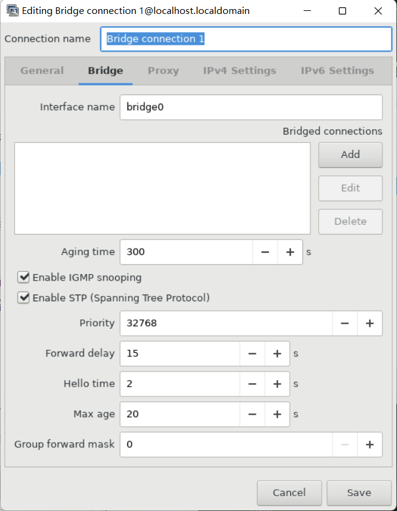
      4. 点 Save。
   3. 对您要添加到桥接的每个接口重复前面的步骤。
5. 可选：配置其他网桥设置，如生成树协议（STP）选项。
6. 配置网桥的 IP 设置。如果要将此网桥用作其他设备的端口，请跳过这一步。
   1. 在 IPv4 Settings 选项卡中，配置 IPv4 设置。例如，设置静态 IPv4 地址、网络掩码、默认网关、DNS 服务器和 DNS 搜索域：
   
   2. 在 IPv6 Settings 选项卡中，配置 IPv6 设置。例如，设置静态 IPv6 地址、网络掩码、默认网关、DNS 服务器和 DNS 搜索域：
   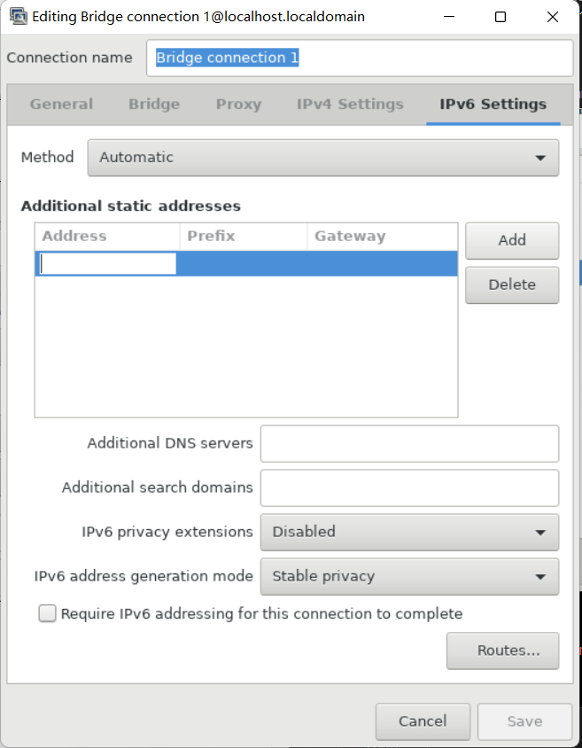
7. 保存网桥连接。
8. 关闭 nm-connection-editor。

**验证**

- 使用 ip 命令来显示作为特定网桥端口的以太网设备的链接状态。
    ```
    # ip link show master bridge0
    3: enp7s0: <BROADCAST,MULTICAST,UP,LOWER_UP> mtu 1500 qdisc fq_codel master bridge0 state UP mode DEFAULT group default qlen 1000
        link/ether 52:54:00:62:61:0e brd ff:ff:ff:ff:ff:ff
    4: enp8s0: <BROADCAST,MULTICAST,UP,LOWER_UP> mtu 1500 qdisc fq_codel master bridge0 state UP mode DEFAULT group default qlen 1000
        link/ether 52:54:00:9e:f1:ce brd ff:ff:ff:ff:ff:ff
    ```
- 使用 bridge 命令来显示作为任意网桥设备中端口的以太网设备状态：
    ```
    # bridge link show
    3: enp7s0: <BROADCAST,MULTICAST,UP,LOWER_UP> mtu 1500 master bridge0 state forwarding priority 32 cost 100
    4: enp8s0: <BROADCAST,MULTICAST,UP,LOWER_UP> mtu 1500 master bridge0 state listening priority 32 cost 100
    5: enp9s0: <BROADCAST,MULTICAST,UP,LOWER_UP> mtu 1500 master bridge1 state forwarding priority 32 cost 100
    6: enp11s0: <BROADCAST,MULTICAST,UP,LOWER_UP> mtu 1500 master bridge1 state blocking priority 32 cost 100
    ...
    ```
    要显示特定以太网设备的状态，请使用 bridge link show dev ethernet_device_name 命令。

## 12.3.使用 nmstatectl 配置网络桥接

**前提条件**

- 在服务器中安装两个或者两个以上物理或者虚拟网络设备。
- 要将以太网设备用作网桥的端口，必须在服务器中安装物理或者虚拟以太网设备。
- 要使用 team 、bond 或 VLAN 设备作为网桥中的端口，请在 port 列表中设置接口名称，并定义对应的接口。
- nmstate 软件包已安装。

**流程**

1. 创建包含以下内容的 YAML 文件， ~/create-bridge.yml ：
    ```
    ---
    interfaces:
    - name: bridge0
    type: linux-bridge
    state: up
    ipv4:
        enabled: true
        address:
        - ip: 192.0.2.1
        prefix-length: 24
        dhcp: false
    ipv6:
        enabled: true
        address:
        - ip: 2001:db8:1::1
        prefix-length: 64
        autoconf: false
        dhcp: false
    bridge:
        options:
        stp:
            enabled: true
        port:
        - name: enp1s0
        - name: enp7s0
    - name: enp1s0
    type: ethernet
    state: up
    - name: enp7s0
    type: ethernet
    state: up

    routes:
    config:
    - destination: 0.0.0.0/0
        next-hop-address: 192.0.2.254
        next-hop-interface: bridge0
    - destination: ::/0
        next-hop-address: 2001:db8:1::fffe
        next-hop-interface: bridge0
    dns-resolver:
    config:
        search:
        - example.com
        server:
        - 192.0.2.200
        - 2001:db8:1::ffbb
    ```
2. 将设置应用到系统：
    ```
    # nmstatectl apply ~/create-bridge.yml
    ```

**验证**

1. 显示设备和连接的状态：
    ```
    # nmcli device status
    DEVICE      TYPE      STATE      CONNECTION
    bridge0     bridge    connected  bridge0
    ```
2. 显示连接配置集的所有设置：
    ```
    # nmcli connection show bridge0
    connection.id:              bridge0
    connection.uuid:            e2cc9206-75a2-4622-89cf-1252926060a9
    connection.stable-id:       --
    connection.type:            bridge
    connection.interface-name:  bridge0
    ...
    ```
3. 以 YAML 格式显示连接设置：
    ```
    # nmstatectl show bridge0
    ```

