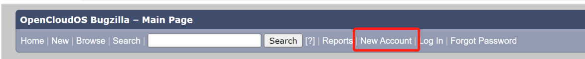
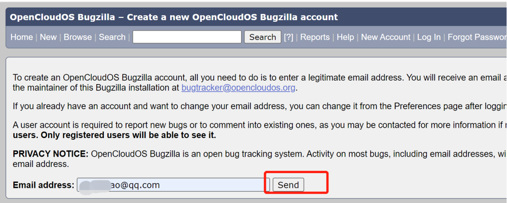
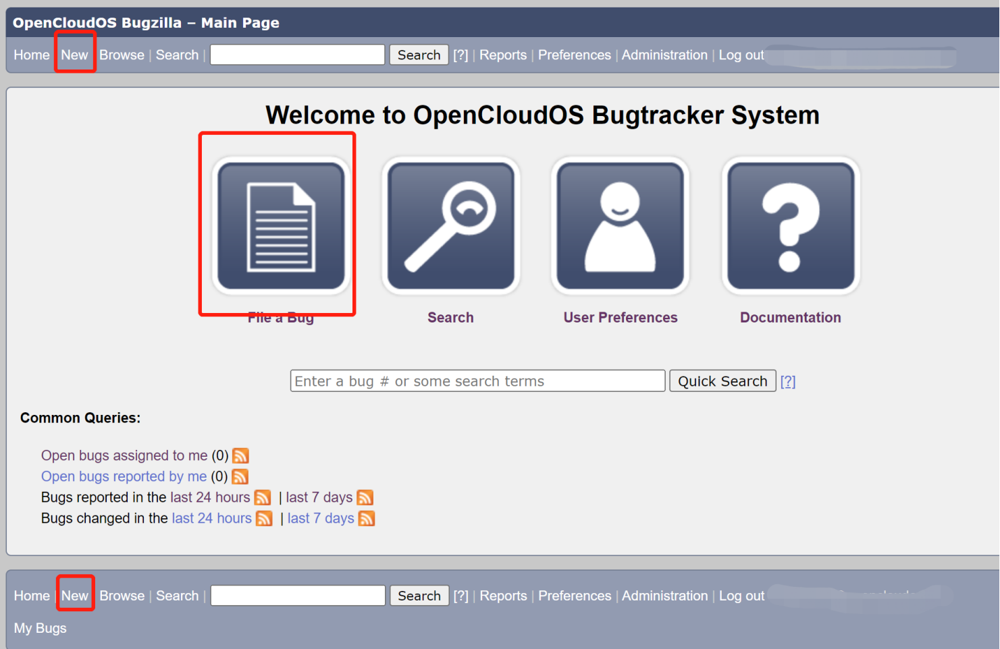
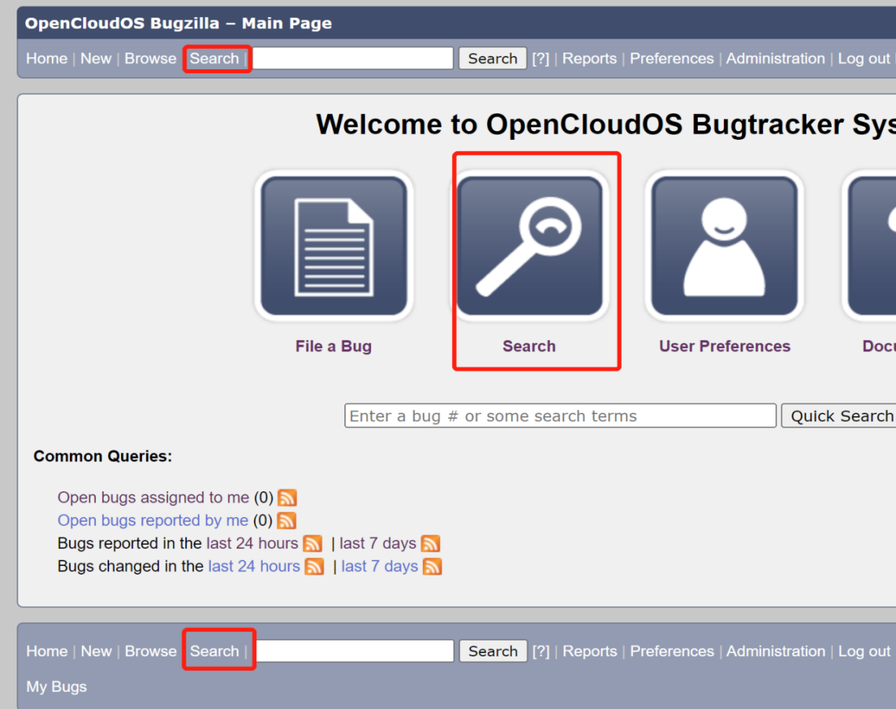

# Bugzilla使用手册

## 1. Bugzilla简要介绍

Bugzilla是一个来自Mozilla的开源缺陷跟踪系统。可跟踪和管理软件开发中的错误和问题。其功能包含报告Bug, 查询 Bug ，记录bug并产生报表,跟踪bug处理解决状态等等。

OpenCloudOS搭建使用Bugzilla开源缺陷跟踪系统，使我们更好的跟踪记录OpenCloudOS开发维护过程中的错误的处理过程，提供给用户一个提交问题，咨询问题的平台，亦方便开发人员对问题进行溯源。欢迎您在OpenCloudOS Bugzilla官方网站上为我们提出宝贵的建议：https://bugs.opencloudos.tech/。

此文档主要介绍Bugzilla普通用户的使用。翻译自Bugzilla官方用户手册：<https://bugzilla.readthedocs.io/en/5.0/using/index.html>。

## 2. 用户注册

Bugzilla创建用户的过程：

1> 点击主页上方的New Account。

> 注：如果新帐户链接不可用，这意味着安装管理员已禁用自注册。与管理员交谈以了解如何获取帐户。

2> 填写一个有效的邮箱地址，填好后，点击send按钮。

3> 你将会收到一封来自bugtracker@opencloudos.org的邮件，其中包含您的登录名（通常与电子邮件地址相同)，以及一个用于单击以确认您的注册的URL。

4> 确认注册后，Bugzilla会询问您的真实姓名（可选，但建议使用）并要求您设置密码。

5> 注册好后，您可点击主页上方的Log In,填写您的登录名和密码进行登录。

## 3. OpenCloudOS Bugzilla Product 产品介绍

点击首页上方的Browse选项，可以看到OpenCloudOS Bugzilla中所有产品介绍。目前有OpenCloudOS和OpenCloudOS SIG两个产品（Product）。

OpenCloudOS产品下记录OpenCloudOS 发行版产品线相关的错误。OpenCloudOS版本产品下目前设置了三类组件：General、Install、Pakages，分别为OpenCloudOS 产品使用过程中一般问题、安装问题、软件包相关问题的提交入口。

OpenCloudOS SIG（特别兴趣小组）产品提交记录OpencloudOS各个兴趣小组的相关bug。其下有Release、Security、Kernel等多个主题SIG组，不同主题的SIG组织主导不同的技术方向。

## 4. 提交Bug

### 4.1 报告新Bug

提交错误的程序如下：

1> 单击页面页眉或页脚中的New选项，或主页上的【File a Bug】选项。

2> 点击后将来到一个页面要求您选择发现错误的产品。如OpenCloudOS发行版使用过程中的遇到的软件问题、安装问题可以在这个产品下提。

3> 选择产品后，就会来到一个bug表单细节填写页面。有如下的字段：

- **Product(产品)**：显示上一个步骤你选择的产品。
- **Reporter(提交人)**：显示作为提交人的你的登录账号（一般为邮箱）。
- **Component(组件)**：选择你准备提交的bug对应的组件，也就是代表该产品bug的类别。点击一个组件后，会在右侧Component Description框中提示该组件的介绍。
- **Version(版本)**： 选择你准备提交的bug针对的产品发布版本的编号或名称。比如OpenCloudOS项目下的发行版8.5。
- **Sucurity(严重程度)**：表示问题的严重程度------从blocker阻塞（"应用程序不可用"）到minor微不足道（"轻微的外观问题"）。您还可      以使用此字段来指示错误是否是增强请求。如果您发现的错误使程序崩溃，它可能是一个主要(major)或严重(critical)错误；如果它是某个地方的错字，那是非常轻微(minor)的；如果它是您的希望看到实施，那么这是一个增强型错误(enhancement)。
- **Hardware(硬件)**：在这里选择错误出现的硬件环境，比如个人电脑。
- **OS(操作系统)**: 选择错误出现的操作系统环境。
- **Summary(摘要)**：在这里填写这个bug的提供简短但描述性的摘要。摘要最好能直接明确的突出这个bug的重点，不要写笼统模糊的语句，错误的示例是："我发现了一个错误"之类的描述。
- **Description(描述)**：在这里填写这个bug的详细描述。在描述中，详细列出重现您遇到的问题的步骤。尝试将这些步骤限制在重现问题所需的最低限度。这将使开发人员更容易理解和复现你的错误，并且他们在合理的时间范围内考虑您的错误的可能性会高得多。尽量确保摘要中的所有内容也在描述中。摘要经常更新，这将确保您的原始信息易于访问。
- **Attachment(附件)**：在提交错误时，您可以在此处附加文档（测试用例、补丁或问题的屏幕截图）。
- **其他高级选项**：还有一些高级选项，可点击Show Advanced Fields来显示，有些选项仅管理员或者项目经理等有特殊权限的人才可编辑具体可参看第5节Bug的高级选项。

4> 当你填完上述的表单内容后，请阅读您将提交的错误报告。删除所有拼写错误；否则，对某些特定单词运行查询的开发人员可能找不到您的错误，因此您的错误不会引起任何注意。还要确保你没有忘记开发人员为了重现问题而应该知道的任何重要信息，并确保你对问题的描述足够明确和清晰。当您认为您的错误报告已准备就绪时，最后一步是单击【Submit Bug】(提交错误)按钮将您的报告添加到系统中。

### 4.2 克隆已有的Bug

Bugzilla 允许您"克隆"现有的错误。新创建的 bug 将继承旧 bug的大部分设置。这使您可以跟踪需要在新错误中进行不同处理的类似问题。要使用它，请转到您要克隆的错误，然后单击错误页面上的克隆此错误 链接。这将带您进入【Enter Bug】 页面，该页面填充了旧 bug的值。然后，您可以根据需要更改具体的内容。

## 5. Bug的高级选项

高级选项，在提交bug点击Show Advanced
Fields显示或者编辑bug时可看到，有些选项仅管理员、项目经理或其他有特殊权限的人员才可编辑。

- **Status(bug的状态)**：错误的状态------从甚至没有被确认为错误，到被修复并由质量保证部确认修复。如UNCONFIRMED(未确认)、CONFIRMED(已确认)、IN_PROGRESS(处理中)等等。
- **Assignee(受让人)**：指定这个bug的处理人，每个组件有默认的受让人，普通用户无需填写。
- **CC(抄送)**：指定这个bug的变动将抄送邮件的相关人。
- **Alias(别名)**：错误的唯一短文本名称，可用于代替错误编号。
- **Importance(重要性)**：优先级字段用于确定错误的优先级，由受让人或其他有权指导的人（如项目经理）确定。最好不要在其他人的错误上更改它。默认值为P1 到 P5。
- **Target Milestone(目标里程碑)**：修复Bug的未来版本。表示预期将会在这个版本修复这个错误。
- **Modified(修改)**：上次修改Bug的日期和时间。
- **QA Contact(质量保证联系人)**：负责此错误的质量保证的人员。
- **URL(网址)**：与错误关联的 URL。
- **Whiteboard(白板)**：用于向错误添加简短注释和标签的自由格式文本区域。
- **Keywords(关键字)**：管理员可以定义可用于标记和分类错误的关键字，例如crash或regression.
- **Personal Tags(个人标签)**：与全局且所有用户可见的Keywords关键字不同，个人标签是个人标签，只能由其作者查看和编辑。编辑它们不会向其他用户发送任何通知。使用它们来标记和跟踪您个人关心的错误集，使用您自己的分类系统。
- **Dependencies (依赖项)**：如果除非修复了其他错误（取决于），否则无法修复此错误，或者此错误停止修复其他错误（块），则在此处记录它们的编号。
- **Flags(标志)**：标志是一种可以在错误或附件上设置的状态，以指示错误/附件处于某种状态。每个安装都可以定义自己的一组标志，这些标志可以设置在错误或附件上。
- **See Also(关联查看)**： 此 Bugzilla、其他 Bugzillas 或其他 Bug跟踪系统中与此相关的 Bug。
- **Ignore Bug Mail(忽略错误邮件)**：如果您不想再从此错误中获得错误邮件，请设置此选项。
- **Time Tracking(时间跟踪)**：此表格可用于时间跟踪。要使用此功能，您必须是timetracking group参数指定的组的成员。
- **Original estimated time(原始预估时间)**：此字段显示原始估计时间。
- **Current estimated time(当前预估时间)**：此字段显示当前估计时间。这个数字是从Hours Worked工作时间和Hours Left剩余时间计算出来 的。
- **Hours Worked(工作时间)**：此字段显示已工作小时数。
- **Hours Left(剩余小时数)**：此字段的值+Hours Worked(工作时间) 的值将成为新的Current estimated time(当前预估时间) 。
- **%Complete(完成度)**：此字段显示任务完成的百分比。
- **Gain**：此字段显示bug早于原定预计时间的小时数.
- **Deadline(最后期限)**：此字段显示此错误的截止日期。

## 6. Bug的生命周期

目前采用bugzilla默认的bug生命周期，如下图（图片摘自bugzilla官方用户手册）：

## 7. 搜索Bug

单击页面页眉、页脚过主页中央的Search选项可进入bug搜寻页。有简单搜索(Simple Search)和高级搜索(Advanced Search)两种搜索方式。

### 7.1 简单搜索(Simple Search)

如果想查看全部的bug内容，那么在简单搜索(Simple Search)选项中，选择Status：ALL，Product：ALL，Words不填写，点击Search搜索，若有特定的查找目标，则按需选择。

### 7.2 高级搜索(Advanced Search)

高级搜索页面用于生成符合确切标准的所有错误的列表。高级搜索具有为错误中的所有字段选择不同可能值的控件。对于某些字段，可以选择多个值。在这些情况下，Bugzilla会返回字段内容与任何一个选定值匹配的错误。如果未选择任何值，则该字段可以采用任何值。

运行搜索后，您可以点击【Remenber Search as】将其保存为已保存的搜索，该搜索将显示在页脚中。如果您在"querysharegroup"参数定义的组中，您可以与其他用户共享您的查询；有关更多详细信息，请参阅Bugzilla官方用户手册。

## 8. 报告和图表

除了标准的错误列表，Bugzilla还有两种查看错误集的方法。这些是报告（提供数据库当前状态的不同视图）和图表（绘制特定错误集随时间的变化）。报告是错误数据库当前状态的视图。您可以运行基于 HTML表格的报告，或基于图形线/饼图/条形图的报告。图表是 bug 数据库在一段时间内的状态视图。单击页面页眉、页脚的Reports选项可进入报告和图表页。

## 9. 用户设置

单击页面页眉、页脚的Preferences选项或者主页中央的User Preferences可进入用户设置页面。

- **General Preferences(常规用户设置)**：常规用户设置，每项参数都如其名，不言而喻。
- **General Preferences(邮件偏好设置)**：通过这个设置，用户几乎可以完全控制
  Bugzilla 向他们发送多少电子邮件。
- **Saved Searches(搜索保存)**：在这里可以查看和编辑保存的搜索。
- **Account Information(账户信息)**：更改邮箱、密码、以及真实姓名。
- **Permissions(权限)**：显示当前登录用户的所有权限。